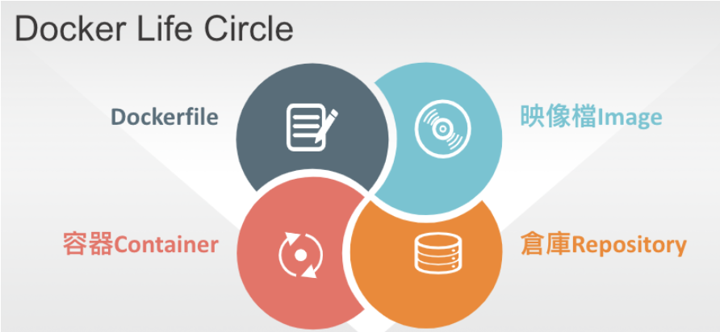

# docker教學
Containers as a Service ( CaaS ) - 容器如同服務
Docker 是一個開源專案，出現於 2013 年初，最初是 Dotcloud 公司內部的 Side-Project。
它基於 Google 公司推出的 Go 語言實作。（ Dotcloud 公司後來改名為 Docker ）

# 目錄
- 什麼是Docker
- 基本介紹 - 映像檔、容器、倉庫
- Dockerfile 說明
- 進階應用 - docker compose
- 進階應用 - docker machine
- 實際案例

## 什麼是Docker
Docker 是一種容器化技術，可以讓你將應用程式、環境、相依套件一起打包成一個可攜帶、可重複部署的容器（Container），確保在任何地方運行時都有相同的行為。
簡單來說，Docker 就像把應用程式放進一個盒子裡，這個盒子裡有你需要的所有東西，去哪都可以直接用，解決「我這邊跑得好好的，怎麼你那邊就出錯」的問題。

## 基本介紹
### Docker 三個基本概念

#### 映像檔（Image）
- Docker 映像檔就是一個唯讀的模板。
- 映像檔可以用來建立 Docker 容器。

#### 容器（Container）
- 容器是從映像檔建立的執行實例。
- Docker 利用容器來執行應用。
- 可以被啟動、開始、停止、刪除。
- 每個容器都是相互隔離的、保證安全的平台。

#### 倉庫（Repository）
- 倉庫是集中存放映像檔檔案的場所。
- 每個倉庫中又包含了多個映像檔。
- 每個映像檔有不同的標籤（tag）。
- 倉庫分為公開倉庫（Public）和私有倉庫（Private）兩種形式。



## 指令說明 - 安裝、指令

### 安裝Docker
[官方文件 Get started with Docker for Mac](https://docs.docker.com/desktop/setup/sign-in/)
[官方官方 Get started with Docker for Windows](https://docs.docker.com/desktop/setup/sign-in/)
[Docker Toolbox overview](https://docs.docker.com/retired/)

### Image 映像檔 常用指令
| 指令               | 說明 | 範例                            |
|-------------------|------|---------------------------------|
| `search`          | 搜尋 | docker search centos             |
| `pull`            | 下載 | docker pull centos               |
| `images`          | 列表 | docker images                    | 
| `run`             | 執行 | docker run -ti centos /bin/bash  |
| `rmi [Image ID]`  | 刪除 | docker rmi 615cb40d5d19          |
| `build`           | 建立 | docker build -t member:1 .       |
| `login`           | 登入 | docker login docker.okborn.com   |
| `push`            | 上傳 | docker push                      |

##### Search 搜尋 Centos 映像檔
```shell
$ docker search centos
NAME                                DESCRIPTION                                    STARS     OFFICIAL   AUTOMATED
centos                              The official build of CentOS.                  7000+     [OK]       
centos/systemd                      CentOS with systemd as init.                   200+                 [OK]
centos/mysql-57-centos7             MySQL 5.7 for CentOS 7                         150+                 [OK]
centos/httpd-24-centos7             Apache httpd 2.4 for CentOS 7                  100+                 [OK]
centos/python-36-centos7            Python 3.6 for CentOS 7                        90+                  [OK]
centos/postgresql-96-centos7        PostgreSQL 9.6 for CentOS 7                    85+                  [OK]
centos/nginx-112-centos7            Nginx 1.12 for CentOS 7                        60+                  [OK]
```
欄位說明：
NAME:映像檔名稱
DESCRIPTION:映像檔描述
STARS:社群給予的星星數，越高越熱門
OFFICIAL:有 OK 表示官方提供的映像檔
AUTOMATED:有 OK 表示自動化構建的映像檔

##### 顯示目前本機的 Images 列表
```shell
$ docker images

REPOSITORY       TAG          IMAGE ID       CREATED          SIZE
ubuntu           latest       26f74b3b1b7e   2 weeks ago      29MB
nginx            stable       605c77e624dd   3 weeks ago      133MB
mysql            8.0          a1b2c3d4e5f6   4 weeks ago      447MB
node             18-alpine    d5e6f7a8b9c0   5 weeks ago      116MB
python           3.11-slim    f1e2d3c4b5a6   2 months ago     45MB
redis            7.2          b7c8d9e0f1a2   2 months ago     55MB
my-python-app    v1.0         8f9e0d1c2b3a   3 days ago       50MB
```
欄位說明：
REPOSITORY：映像檔來源名稱，官方或自訂名稱
TAG：版本號或標籤
IMAGE ID：映像檔唯一識別碼
CREATED：映像檔建立時間
SIZE：映像檔大小

##### 啟動容器
```shell
$ docker run -ti centos /bin/bash
[root@d3f1a2b4c5d6 /]# cat /etc/redhat-release
CentOS Linux release 7.6.1810(Core)
[root@d3f1a2b4c5d6 /]# ^C
[root@d3f1a2b4c5d6 /]# exit
```
參數說明：
docker run：啟動容器
-i：讓容器的標準輸入保持打開
-t：讓Docker分配一個虛擬終端（pseudo-tty）並綁定到容器的標準輸入上
-d：背景執行
-e：設定環境變數(AAA=BBB)
-p：Port 對應(host port:container port)
-v：資料對應(host folder:container folder)
--name：設定容器名稱

** 在執行RUN 映像檔時，如果沒有下載會先下載在執行 **

rmi : 刪除映像檔前要先移除所有Container
build : 使用build 指令時要先切換到Dockerfile 目錄下面

### Container 容器 常用指令
| 指令                 | 說明                  | 範例                          |
|----------------------|----------------------|-------------------------------|
| `run`                | 新建或啟動            | docker run -d centos          |
| `start [Contain ID] `| 啟動                 | docker start a469b9226fc8     |
| `stop [Contain ID]`  | 停止                 | docker stop a469b9226fc8      | 
| `rm [Contain ID]`    | 刪除                 | docker rm a4                  |
| `ps -a`              | 列表                 | docker ps -a                  |
| `logs [Contain ID]`  | 查看容器內的資訊      | docker logs -f a4             |
| `exec [Contain ID]`  | 進入容器(開新console) | docker exec -ti a4 /bin/bash  |
| `attach`             | 進入容器(退出停止容器) | dockr attach a4               |
| `inspect`            | 查看                  | docker inspect a4            |

##### 啟動一個 Container 並且執行 ping google.com
```shell
$ docker run centos ping google.com
PING google.com (142.250.200.78) 56(84) bytes of data.
64 bytes from 142.250.200.78: icmp_seq=1 ttl=118 time=22.5 ms
64 bytes from 142.250.200.78: icmp_seq=2 ttl=118 time=23.1 ms
...
```

##### 使用 查看 Container 指令
```shell
$ docker ps 
CONTAINER ID   IMAGE          COMMAND       CREATED         STATUS         PORTS     NAMES
d1f2a3b4c5d6   nginx:latest   "/docker-entrypoint.…"   5 minutes ago   Up 5 minutes   0.0.0.0:8080->80/tcp   web_server

$ docker ps -a
CONTAINER ID   IMAGE           COMMAND                  CREATED         STATUS                      PORTS                  NAMES
d1f2a3b4c5d6   nginx:latest    "/docker-entrypoint.…"   5 minutes ago   Up 5 minutes                0.0.0.0:8080->80/tcp   web_server
a1b2c3d4e5f6   centos          "/bin/bash"              10 minutes ago  Exited (0) 5 minutes ago                           centos_test
b7c8d9e0f1a2   ubuntu:latest   "bash"                   20 minutes ago  Exited (0) 15 minutes ago                          hopeful_volhard
```

ps : 參數說明 or docker ps --help 常用：
-a：顯示全部的容器

欄位說明：
CONTAINER ID：容器ID
IMAGE：映像檔名稱
COMMAND：執行指令
CREATED：創建時間
STATUS：容器狀態
POSTS：開啟的Port號
NAMES：容器名稱

##### 顯示容器的 log
```shell
$ docker logs -f 8a
172.17.0.1 - - [02/Jul/2025:11:00:15 +0000] "GET / HTTP/1.1" 200 612 "-" "Mozilla/5.0"
172.17.0.1 - - [02/Jul/2025:11:00:16 +0000] "GET /favicon.ico HTTP/1.1" 404 555 "-" "Mozilla/5.0"
172.17.0.1 - - [02/Jul/2025:11:00:20 +0000] "GET /index.html HTTP/1.1" 200 1024 "-" "Mozilla/5.0"
172.17.0.1 - - [02/Jul/2025:11:00:25 +0000] "GET /api/status HTTP/1.1" 200 128 "-" "curl/7.81.0"
```

參數說明:
docker logs：查看容器日誌
-f：不會跳出，會一直列印最新的log資訊

##### 進入容器
```shell
$ docker exec -ti 8a /bin/bash
[root@d1f2a3b4c5d6 /]#
```

參數說明:
docker exec：在已啟動的容器內執行指令
-i ：則讓容器的標準輸入保持打開
-t：讓Docker分配一個虛擬終端（pseudo-tty）並綁定到容器的標準輸入上
-e：設定環境變數(AAA=BBB)

##### 查看容器資訊
```shell
$ docker inspect 8a
[
    {
        "Id": "8a7b6c5d4e3f2g1h0i",
        "Created": "2025-07-02T02:30:15.123456789Z",
        "Path": "/bin/bash",
        "Args": [],
        "State": {
            "Status": "running",
            "Running": true,
            "Paused": false,
            "Restarting": false,
            "OOMKilled": false,
            "Dead": false,
            "Pid": 12345,
            "ExitCode": 0,
            "Error": "",
            "StartedAt": "2025-07-02T02:30:16.789012345Z",
            "FinishedAt": "0001-01-01T00:00:00Z"
        },
        "Image": "sha256:d5e6f7a8b9c01234",
        "Name": "/happy_mirzakhani",
        "RestartCount": 0,
        "NetworkSettings": {
            "IPAddress": "172.17.0.2",
            "Ports": {
                "80/tcp": [
                    {
                        "HostIp": "0.0.0.0",
                        "HostPort": "8080"
                    }
                ]
            }
        },
        "Mounts": []
    }
]
```

### Registry 倉庫 常用指令
| 指令     | 說明       | 範例                          |
|----------|----------|-------------------------------|
| `commit` | 容器存檔  | docker commit db aaa:v1                   |
| `pull`   | 下載      | docker pull docker.okborn.com/okborn:base |
| `tag`    | 標籤      | docker tag aaa docker.okborn.com/aaa      | 
| `push`   | 上傳      | docker push docker.okborn.com/member:1 |
| `login`  | 登入      | docker login docker.okborn.com |
| `export` | 匯出      | docker export 7691a814370e > ubuntu.tar |
| `import` | 匯入      | cat ubuntu.tar sudo docker import - test/ubuntu:v1.0 |

