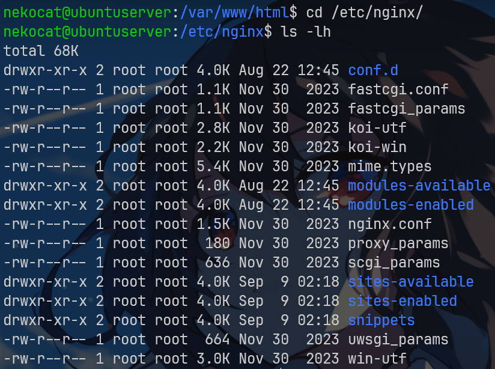
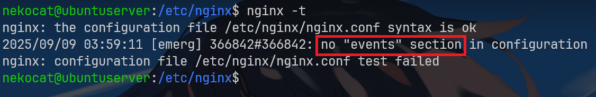
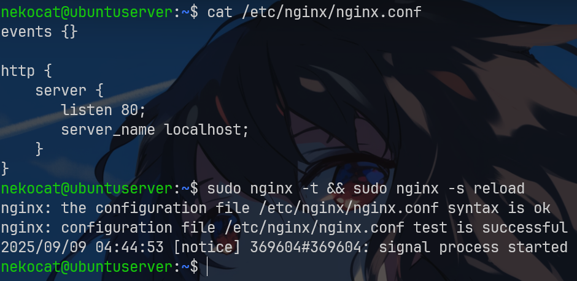
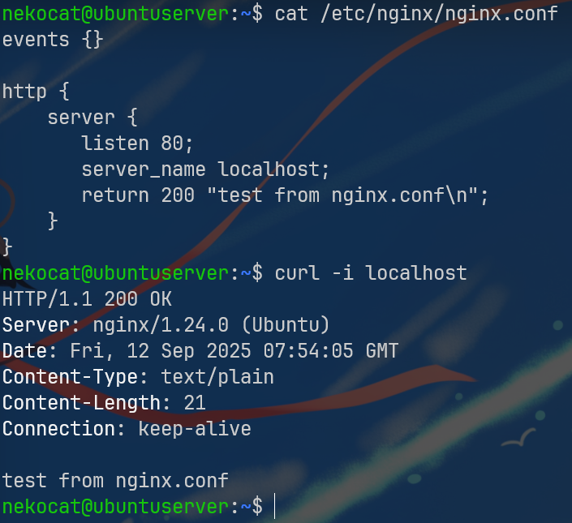
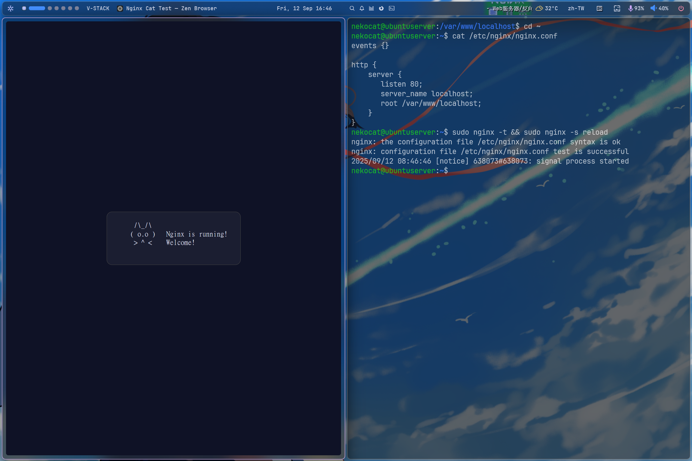
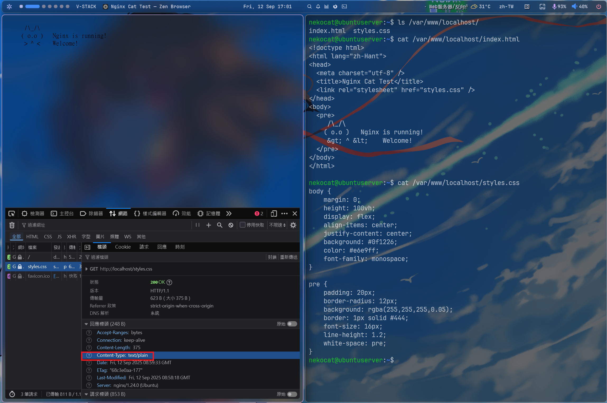
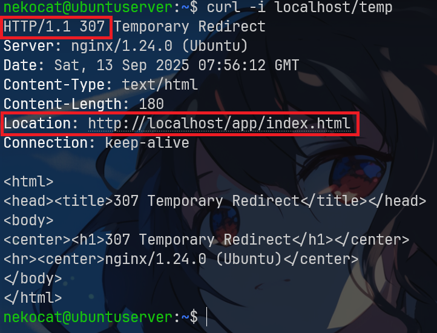
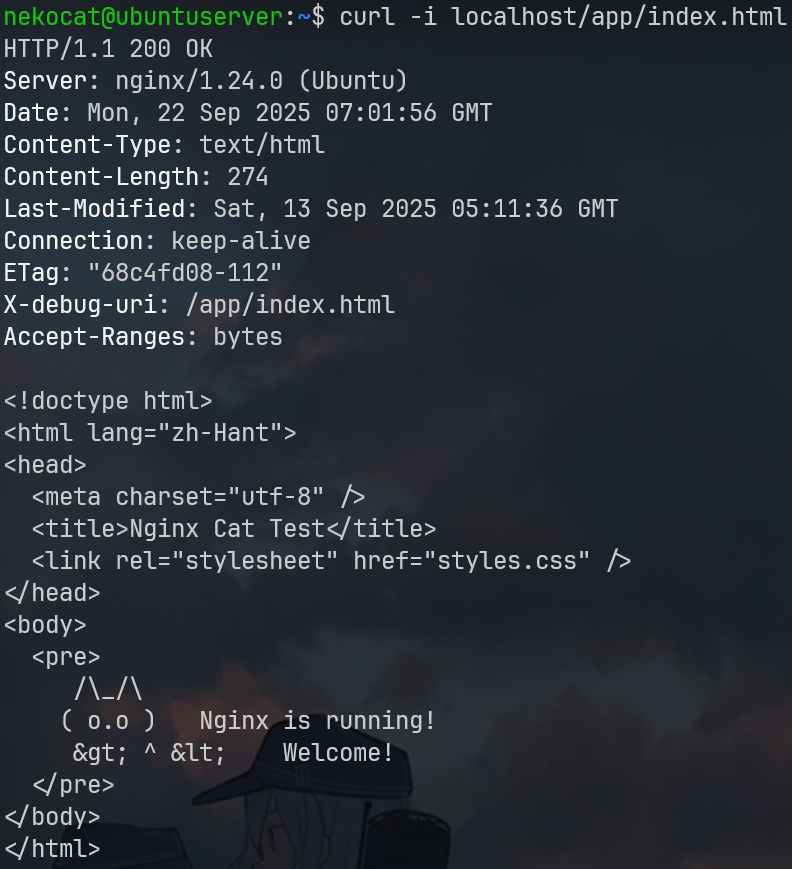
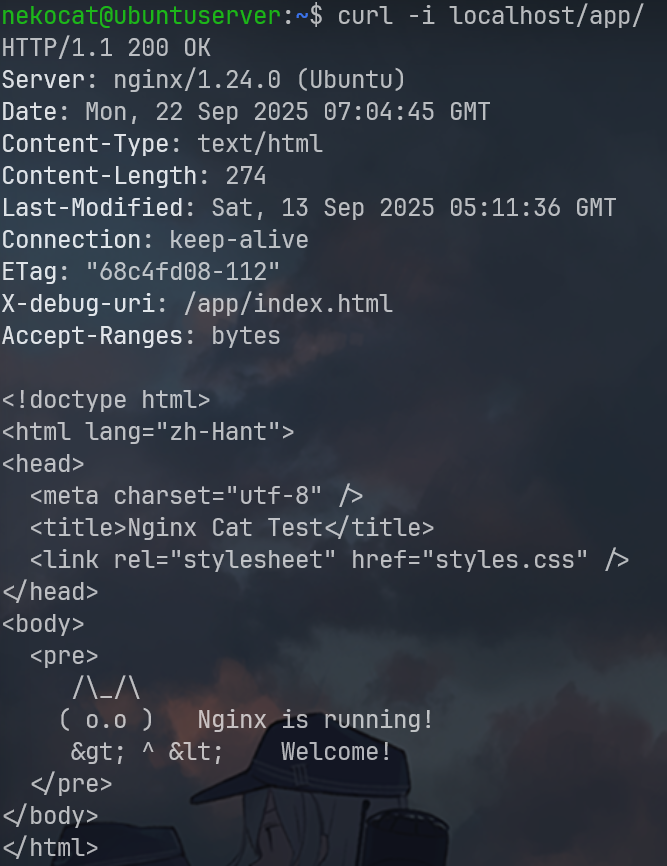
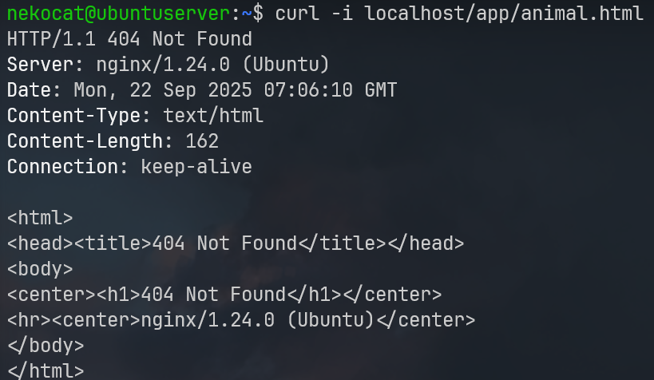

# Nginx 使用教學入門
`Nginx`是一款開源的網路伺服器，能夠用於多種網路服務，包括 `HTTP 伺服器`、`反向代理伺服器`、`郵件代理伺服器`等。`Nginx` 設計之初，就專為處理**高並發**、**高流量**的網路服務所需求的需求。其高效的效能與穩定的運作，讓 `Nginx` 在全球許多知名的網站中，都有其身影。

# Nginx 有什麼功用？
`Nginx` 最主要的功能是作為網頁伺服器，處理來自網路的 `HTTP` 請求，並返回相對應的內容。另外，`Nginx` 也常常被使用為反向代理伺服器，這表示 `Nginx` 會在網站與使用者之間擔任傳遞訊息的角色，這樣可以大大提升網站的效能，以及提供更多的靈活度。此外，`Nginx` 也能提供負載均衡的服務，這樣可以幫助分散伺服器的負擔，提供更好的效能。

# 安裝Nginx
要開始使用 `Nginx`，我們首先需要在我們的機器上安裝 `Nginx`。

在 Ubuntu 系統中，可以透過以下的命令進行安裝：
```bash
$ sudo apt update
$ sudo apt install nginx
```

使用以下指令查看是否安裝完成`Nginx`
```bash
$ nginx -v
```

安裝完成後，我們可以透過以下命令檢查`Nginx`是否已經成功安裝並開始運作:
```bash
$ systemctl status nginx
```
在瀏覽器中輸入您的伺服器 IP，如果看到歡迎頁面，表示 Nginx 已經成功運作。

Nginx 的設定檔案通常會存放在 `/etc/nginx` 目錄下，而網站的設定檔案則會在 `/etc/nginx/sites-available` 目錄中。要啟用網站，需要將設定檔案連結到 `/etc/nginx/sites-enabled` 目錄。

基本的 Nginx 網站設定檔案可能會看起來像這樣：

`nginx.conf`:
```
server {
    listen 80 default_server;
    listen [::]:80 default_server;

    root /var/www/html;
    index index.html index.htm index.nginx-debian.html;

    server_name _;

    location / {
        try_files $uri $uri/ =404;
    }
}
```

設定完成後再瀏覽器輸入`http://localhost/`就可以看到`Nginx`開啟的網頁服務


每當修改了 `Nginx` 的設定檔案後，我們都需要重新載入或重啟 `Nginx`，讓新的設定生效：
```bash
$ sudo systemctl reload nginx
# 或者
$ sudo systemctl restart nginx
```

# Web Server
首先進入`nginx`的資料夾中
```bash
$ cd /etc/nginx/
$ ls -lh
```


每個linux發行版的配置略有不同
我們先關注`nginx.conf`他是`Nginx`的主設定檔
首先先將`/etc/nginx/`裡的`nginx.conf`先轉成備份然後創建一個空的`nginx.conf`
```bash
sudo mv nginx.conf nginx.conf.bak
touch nginx.conf
```

我們可以使用`nginx -t`查看配置文件有沒有問題


這裡發現`nginx`告訴我們沒有`events`的`section`
在這裡`events`是用來告訴`nginx`如何處理連接的

我們使用`vim`來修改`nginx.conf`

`nginx.conf`:
```
events {}
```

再次使用`nginx -t`查看配置文件有沒有問題


因為我們更改了`nginx`的配置文件所以要使用`nginx -s reload`將nginx重新加載一下

但是此時我們會發現`http://localhost/`的網頁無法鮺入了
由於我們只有配置`events`沒有配置`http`服務所以才無法載入網頁服務

所以我們要在`nginx.conf`再加入`http模塊`並告訴模塊監聽`80 port`

`nginx.conf`:
```
events {}

http {
    // 定義虛擬服務器(可以有多個server塊)
    server {
        listen 80; // 監聽80 port
        server_name localhost; // 定義server的ip地址或域名
    }
}
```

更改完後記得查看有沒有錯誤跟重載`nginx`
```bash
$ nginx -t && nginx -s reload
```


我們可以使用`return`返回`http`狀態碼及內容

`nginx.conf`:
```
events {}

http {
    server {
       listen 80;
       server_name localhost;

       return 200 "test from nginx.conf\n";
    }
}
```
使用`curl`使令訪問`localhost`查看我們返回的內容


現在如果我們想要將我們寫好的網頁給`nginx`進行部屬我們可以使用下面的指令創建一個存放index.html的地方
```bash
$ mkdir /var/www/localhost
$ cd /var/www/localhost
$ vim index.html
```
在`/var/www/localhost/index.html`寫入內容
```html
<!doctype html>
<html lang="zh-Hant">
<head>
  <meta charset="utf-8" />
  <title>Nginx Cat Test</title>
  <style>
    body {
      margin: 0;
      height: 100vh;
      display: flex;
      align-items: center;
      justify-content: center;
      background: #0f1226;
      color: #e6e9ff;
      font-family: monospace;
    }
    pre {
      padding: 20px;
      border-radius: 12px;
      background: rgba(255,255,255,0.05);
      border: 1px solid #444;
      font-size: 16px;
      line-height: 1.2;
      white-space: pre;
    }
  </style>
</head>
<body>
  <pre>
     /\_/\
    ( o.o )   Nginx is running!
     &gt; ^ &lt;    Welcome!
  </pre>
</body>
</html>
```
然後把`nginx.conf`的`retrun`刪除改成設定`root`

`nginx.conf`:
```
events {}

http {
    server {
       listen 80;
       server_name localhost;

       root /var/www/localhost;
    }
}
```
然後檢查重載
```bash
$ nginx -t && nginx -s reload
```


在默認情況下`nginx`會默認指定`index.html`為默認網頁入口
我們可以透過`index`指令來改變默認網頁入口文件

`nginx.conf`:
```
events {}

http {
    server {
       listen 80;
       server_name localhost;

       root /var/www/localhost;
       index test.html;
    }
}
```

在實際應用中 一個網頁會是由許多文件組成的
在剛剛的案例我們把範例網頁中的`css`分開
變成

`index.html`:
```html
<!doctype html>
<html lang="zh-Hant">
<head>
  <meta charset="utf-8" />
  <title>Nginx Cat Test</title>
  <link rel="stylesheet" href="styles.css" />
</head>
<body>
  <pre>
     /\_/\
    ( o.o )   Nginx is running!
     &gt; ^ &lt;    Welcome!
  </pre>
</body>
</html>
```

`styles.css`:
```css
body {
    margin: 0;
    height: 100vh;
    display: flex;
    align-items: center;
    justify-content: center;
    background: #0f1226;
    color: #e6e9ff;
    font-family: monospace;
}

pre {
    padding: 20px;
    border-radius: 12px;
    background: rgba(255,255,255,0.05);
    border: 1px solid #444;
    font-size: 16px;
    line-height: 1.2;
    white-space: pre;
}
```
你會發現在網頁上`css`上效果消失了
這是因為`nginx`將`css`認為是一般的`text`傳給網頁


要解決這個問題我們需要在`nginx.conf`將`/etc/nginx/mime.types`給引入
`mime.types`文件內部定義了幾乎所有的文件種類以便網頁識別

`nginx.conf`:
```
events {}

http {

    include /etc/nginx/mime.types; // 在http模塊引入使得其他server模塊也能使用

    server {
       listen 80;
       server_name localhost;

       root /var/www/localhost;
    }
}
```
檢查重載就可以發現已經可以載入`styles.css`
```bash
$ nginx -t && nginx -s reload
```

現在我們知道了可以使用`include`的方式將`conf`檔用不同的檔案組合起來
那我們現在來試試看將`server`塊包成一個`conf`檔案並用`include`引入`nginx.conf`中
在`/etc/nginx`有一個`conf.d`目錄可以放我們自定義的一些模塊

`nginx.conf`:
```
events {}

http {

    include /etc/nginx/mime.types; // 在http模塊引入使得其他server模塊也能使用
    
    include /etc/nginx/conf.d/*.conf; // 引入conf.d中的所有conf檔
    
}
```

`/etc/nginx/conf.d/default.conf`:
```
server {
    listen 80;
    server_name localhost;

    root /var/www/localhost;
}
```

這樣如果要改動其他設定只需改動`conf.d`內的檔案就好了

# location指令
我們改寫一下`/etc/nginx/conf.d/default.conf`

`/etc/nginx/conf.d/default.conf`:
```
server {
    listen 80;
    server_name localhost;

    location / {
        root /var/www/localhost;
    }
}
```
這樣可以更好的定義路徑

當我們想要讓用戶訪問`http://localhost/app`可以訪問到`/var/www/localhost/index.html` 我們可能會寫

`/etc/nginx/conf.d/default.conf`:
```
server {
    listen 80;
    server_name localhost;

    location /app {
        root /var/www/localhost;
    }
}
```
但我們會發現無法訪問到`http://localhost/app`
其實是因為`nginx`需要匹配到對應的資料夾內的`index.html`
因此我們要在`/var/www/localhost`內建立`app/`後將`index.html`搬進去
```bash
$ mkdir /var/www/localhost/app/
$ mv /var/www/localhost/index.html /var/www/localhost/app/
$ mv /var/www/localhost/styles.css /var/www/localhost/app/
```

我們可以用`curl`測試看看


這裡會發現當我們訪問`http://localhost/app`時會出現錯誤
訪問`http://localhost/app/`時則是正常的
這是因為當我們訪問`http://localhost/app`時是在根目錄底下找`app`文件
訪問`http://localhost/app/`則是默認找`app`目錄下的`index.html`文件
這跟我們直接訪問`http://localhost/app/index.html`的效果是一樣的
我們也可以在`/var/www/localhost/`底下創建`apple/index.html`
這樣訪問`http://localhost/apple/`或`http://localhost/apple/index.html`也是可以看到的

這樣有一個問題是可能將將不必要的文件公開給其他人看到
因此我們可以使用匹配符來指定使用者一定要訪問`app/index.html`才能看到網頁

`/etc/nginx/conf.d/default.conf`:
```
server {
    listen 80;
    server_name localhost;

    location = /app/index.html {
        root /var/www/localhost;
    }
}
```

這樣使用者就只能訪問`http://localhost/app/index.html`來取得網頁內容
但我們會發現到使用者只能獲取`html`無法取得`css`
這樣的做法導致我們的配置很不靈活 這時我們就可以使用正則表達式了
我們可以先來看一個簡單的例子 等等再解決我們`css`無法載入的問題

譬如說我們在`/var/www/localhost/videos`有20部影片想要對外公開裡面的15部


我們可以這樣寫

`/etc/nginx/conf.d/default.conf`:
```
server {
    listen 80;
    server_name localhost;

    location ~ ^/videos/videos(0[1-9]|1[0-5])\.mp4$ {
        root /var/www/localhost;
    }
}
```

我們現在看回剛剛的`css`問題
我們可以這樣寫

`/etc/nginx/conf.d/default.conf`:
```
server {
    listen 80;
    server_name localhost;

    location ~ ^/app/(index\.html|.*\.(?:css|js|png|jpg|jpeg|svg|ico|webp|woff2?))$ {
        root /var/www/localhost;
    }
}
```
以下是正則表達式的一些解釋:
1. `~`
   - 在 `location` 裡，`~` 代表「使用正則表達式，大小寫敏感」。
   - 如果寫 `~*`，則是不分大小寫。(但是在用戶實際訪問網址還是要正確輸入大小寫)
2. `^/app/`
   - `^` 表示字串開頭要符合。
   - `/app/` 就是要求 URL 必須以 `/app/` 開始。
     例如 `/app/index.html`、`/app/styles.css` 都會符合。

3. `(index\.html|.*\.(?:css|js|png|jpg|jpeg|svg|ico|webp|woff2?))`
    
    這裡是一個 **分組 (group)**，`|` 代表「或」的關係。
    - `index\.html` → 只要剛好是 `/app/index.html`，就會匹配。
（注意 `\.`，因為在正則裡 `.` 是萬用字元，要用 `\.` 才能表示「真的小數點」。）
    - `.*\.(?:css|js|png|jpg|jpeg|svg|ico|webp|woff2?)`
    
        → `.*\.` 表示任意檔名加副檔名。
        
        → `(?: … )` 是「非捕獲分組」，只用來做選擇，不會單獨保存。
        
        → `css|js|png|jpg|jpeg|svg|ico|webp|woff2?`

        表示只允許副檔名是這些：`.css` `.js` `.png` `.jpg` `.jpeg` `.svg` `.ico` `.webp` `.woff` `.woff2`。

        `woff2?` 的 `?` 代表「前一個字元可有可無」，所以可匹配 `woff` 或 `woff2`。

4. `$`
   - 代表字串結尾。
        也就是說 URL 必須完整符合這個規則，不會允許後面再跟多的東西。

### 臨時重定向
我們在實際案例中可能會有網頁正在維護或暫時搬家的情況
這種時候就可以使用臨時重定向
總之臨時重定向的意思就是這個資源**暫時**不在原本的 URL，請去另一個 URL 拿吧

我們可以讓用戶訪問`http://localhost/temp`時臨時重定向成`http://localhost/app/index.html`
以下是範例

`/etc/nginx/conf.d/default.conf`:
```
server {
    listen 80;
    server_name localhost;

    root /var/www/localhost;

    location /temp {
        return 307 /app/index.html;
    }
}
```


雖然這樣可以符合我們的需求但是在網頁效能看來這種寫法會比較慢一點 因為用以上的方法會導致在用戶端瀏覽器再發一次請求
我們可以使用另一種比較快的方法 讓伺服器內部直接改路徑 不用讓用戶瀏覽器再發一次請求

`/etc/nginx/conf.d/default.conf`:
```
server {
    listen 80;
    server_name localhost;

    root /var/www/localhost;

    rewrite /temp /app/index.html;
}
```

我們可以結合`try_files $uri`讓`nginx`找不到文件時可以導向到404頁面 如果有找到的話就導向到`index.html`

`/etc/nginx/conf.d/default.conf`:
```
server {
    listen 80;
    server_name localhost;

    root /var/www/localhost;
    index index.html;

    location / {
        add_header X-debug-uri "$uri";
        try_files $uri $uri/ =404;
    }
}
```

我們順便在`header`加上`X-debug-uri`來查看`$uri`的值







我們可以看到在訪問`localhost/app/index.html`跟`localhost/app/`時`X-debug-uri`都會自動匹配`/app/index.html` 這是因為我們在`try_files`加上`$uri`跟`$uri/`還有我們前面定義的`index index.html`
當我們訪問一個不存在的頁面(如`localhost/app/animal.html`) `try_files`會丟出我們設定的第三個參數`=404`使網頁導向到`404`頁面

在返回`404`後其實我們可以發現這個`404`頁面是`nginx`的默認畫面 那麼要如何修改成自訂義的畫面呢?

我們可以在存放html的文件夾內創建一個404.html的文件
然後在`/etc/nginx/conf.d/default.conf`裡這樣寫

`/etc/nginx/conf.d/default.conf`:
```
server {
    listen 80;
    server_name localhost;

    root /var/www/localhost;
    index index.html;
    error_page 404 /404.html;

    location / {
        add_header X-debug-uri "$uri";
        try_files $uri $uri/ =404;
    }
}
```

這樣我們就可以訂製自己的`404`頁面了

# 反向代理
當今天你有兩個不同的項目開在不同的端口上
例如今天你有兩個`nextjs`項目一個叫做`next1`一個叫做`next2`
那麼我們今天想要讓使用者透過網址控制流量導向哪一個項目

假設我們在`next1`的`next.config.mjs`設定`basePatch`為`/nextapp1`
然後`next2`的`next.config.mjs`設定`basePatch`為`/nextapp2`

再來讓`next1`跟`next2`分別運行在`localhost:3000`跟`localhost:3001`端口

然後我們到`/etc/nginx/conf.d/default.conf`裡這樣寫

`/etc/nginx/conf.d/default.conf`:
```
server {
    listen 80;
    server_name localhost;

    root /var/www/localhost;
    index index.html;
    error_page 404 /404.html;

    location /nextapp1 {
        proxy_pass http://localhost:3000;
    }

    location /nextapp2 {
        proxy_pass http://localhost:3001;
    }
}
```

這樣透過不同的路徑就可以被引導到不同的項目了
在實戰中我們還可以透過不同的server_name反向代理到不同的後端技術中

# 負載均衡

當你的網站流量變多時，你可能會增加你的服務器進行一個分流的動作
這裡就可以使用到`nginx`的負載均衡功能了

我們要把剛剛的`nextapp1`跟`nextapp2`作為兩個負載服務器使用
一樣還是分別開在`localhost:3000`跟`localhost:3001`端口
可以在`/etc/nginx/conf.d/default.conf`裡這樣寫

`/etc/nginx/conf.d/default.conf`:
```
upstream backend-servers {
    server localhost:3000;
    server localhost:3001;
}

server {
    listen 80;
    server_name localhost;

    root /var/www/localhost;
    index index.html;
    error_page 404 /404.html;

    location / {
        proxy_pass http://backend-servers;
    }
}
```

這樣`nginx`就會隨機分配流量給負載服務器了
但是當我們今天有兩台配置不一樣的主機 例如一台是高配置另一台則是低配置
那我們可以使用`weight`來設定每台服務器分配的流量

`/etc/nginx/conf.d/default.conf`:
```
upstream backend-servers {
    server localhost:3000 weight=2;
    server localhost:3001 weight=6;
}

server {
    listen 80;
    server_name localhost;

    root /var/www/localhost;
    index index.html;
    error_page 404 /404.html;

    location / {
        proxy_pass http://backend-servers;
    }
}
```

`weight`的值被分配的越大，被分配到的次數就會越多

以上就是`nginx`的簡易使用方式。