# PostgreSQL 使用教學入門
我們希望能夠用一套完善的資料庫管理系統（DBMS，全稱 Database Management System）來處理資料在電腦上的保存問題，資料庫管理系統顧名思義就是用來管理資料儲存相關操作的事情，那一般常見的有支援 SQL （Structured Query Language）語法管理的資料庫，以及所謂的 NoSQL 資料庫。在我們的應用中，由於只是做一個簡單教學，所以其實用哪套資料庫系統都可以。但是如果今天你的應用比較複雜，或是對資料存取有特殊需求的話，可能就會需要比較一下各個資料庫的優缺點來決定要使用哪套資料庫。image: "./cover.jpg"

# PostgreSQL 資料庫系統
PostgreSQL 是一套強大且開源的資料庫，支援 SQL 語法進行資料操作。在我們今天的使用上除了會使用 UI 來對資料庫進行操作外，也會稍微使用到一些 SQL 語法去讓 PostgreSQL 執行看看。我在使用 SQL 語法的使用會稍微解釋一下，如果想要先了解一下 SQL 語法的話也可以先找詳細的教學來看，在這裡會先列出一些簡單的語法。首先，我們就先來安裝它吧！

首先先點進官網下載頁面，裡面會看到各個平台的下載點（下圖紅框處）。
[前往 PostgreSQL 官網下載](https://www.postgresql.org/download/)
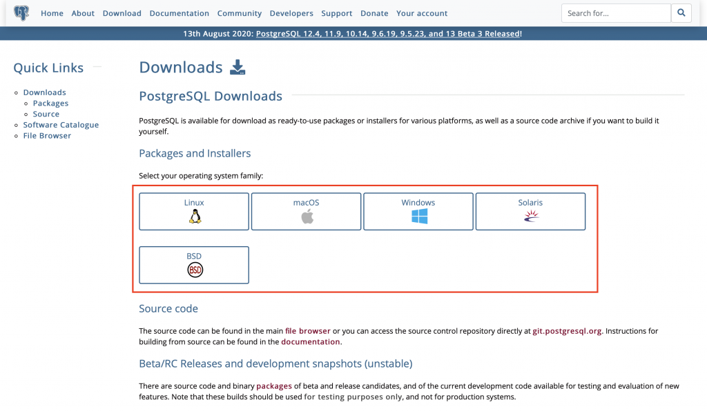

到了各自平台的下載點後，選擇下載 `Interactive installer by EDB`，這個版本會有圖形介面讓你進行安裝，並在安裝資料庫系統的同時，也會一併安裝具有圖形化介面可以讓你管理 PostgreSQL 資料庫的 `pgAdmin` 軟體。
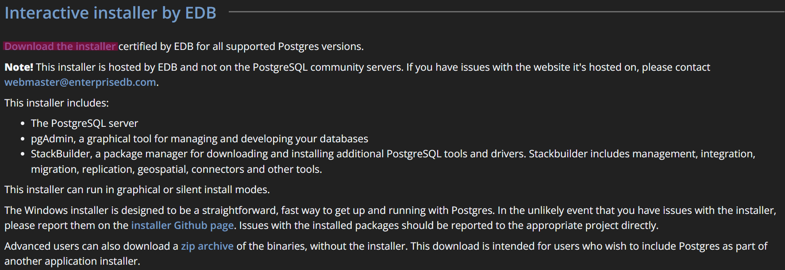

點進去以後，可以根據你想要的 PostgreSQL 版本與作業系統平台來決定要下載哪個，我這邊下載的是 PostgreSQL 17.6 版的 Windows x86-64 平台上所能執行的版本。
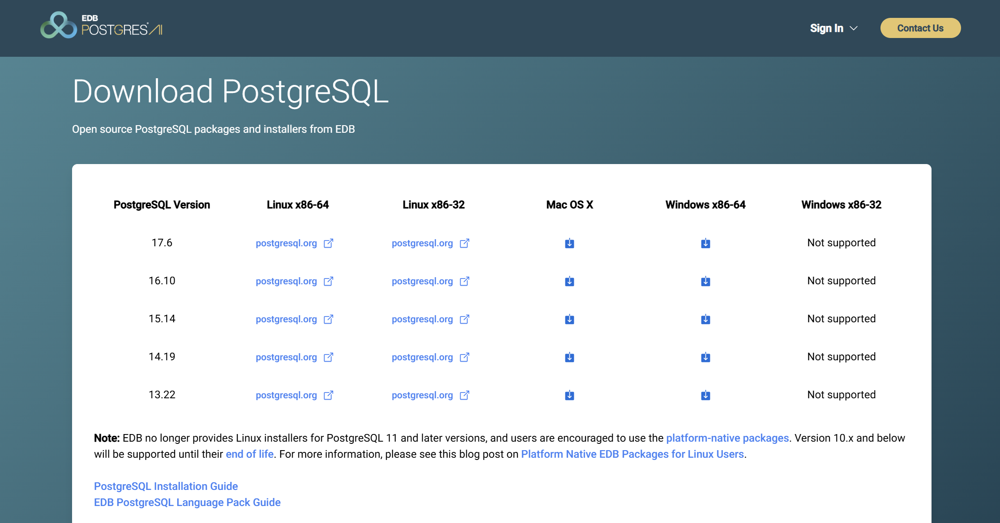

下載完後，就可以點擊安裝檔進行安裝。安裝過程中有幾個會比較需要注意的地方。首先是輸入預設管理員的帳號 `postgres` 的密碼，這個地方輸入的密碼一定要記得，不然到時候會進不去資料庫，要重新設定該密碼的話會相當麻煩的，請小心。

接著會有要資料庫監聽電腦上哪一個 `port` 的設定，用預設的 `5432` 即可。如果不行的話可以任意選個數字看看，但是到時候要連接資料庫的時候要記得資料庫是監聽在哪一個 `port`。

灌好後，即可打開 `pgAdmin` 軟體來使用剛灌好的資料庫了！

# 創建第一個資料庫
打開 `pgAdmin` 後，會跳出瀏覽器來到管理 PostgreSQL 的頁面，首先會跳出一個設定 `Master Password` 的視窗，這個密碼是 `pgAdmin` 用來加密儲存你用 `pgAdmin` 輸入的資訊，以方便你在 `pgAdmin` 上的操作。

接著點擊左方安裝的 PostgreSQL，這時會跳出輸入超級管理員 `postgres` 的密碼的視窗，輸入你安裝時所輸入的密碼即可登入進去。

進去之後，就會看到左邊列表裡面有一大堆東西，在這裡就只看我們會用到的東西即可，其餘的東西暫時你可以先不管它，如果你有興趣的話可以再自行慢慢研究看看。底下最上層圈起來的紅框就是 `Database`，每個 `Database` 裡面可以有多個 `Schema`，而每個 Schema 其實就是多個 `Table` 的集合，而這個 `Table` 就是用來儲存資料的表格。
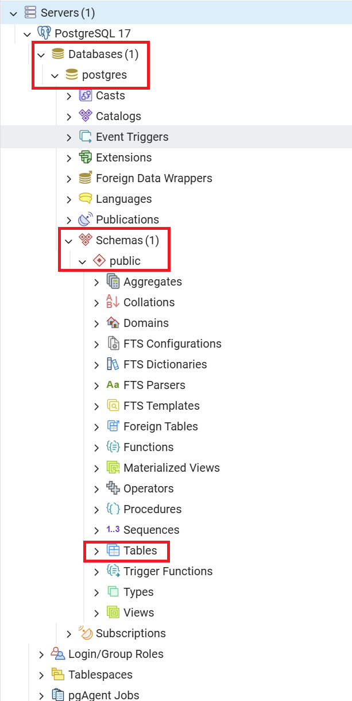

不同的服務我們會各自創建不同的 `Database` 去讓這些服務可以分別去使用，讓它們操作資料的時候不會互相影響到對方。而每個 `Database` 可以再根據存放的資料利用 `Schema` 去進行分類，預設會有一個叫做 `public` 的 `Schema`。最後，存放的資料就是存在 `Table` 之中，`Table` 有點類似於我們在試算表中用到的表格，只是它對於每一欄的欄位可以命名且可以限制它能存放的資料型態為何。

那首先先讓我們在這裡面創建一個測試用的 `Database`，對 `Databases (x)` 這個地方點選右鍵，會出現 `Create` 這個選項，裡面有 `Database...` 這個選項可以點擊。
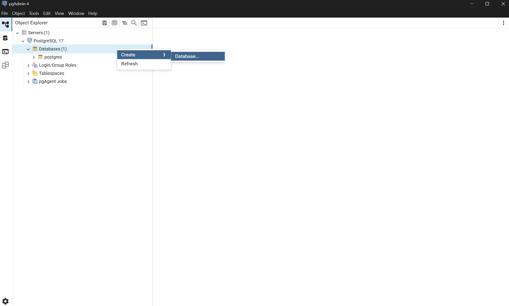

接著會跳出創建資料庫的設定視窗，填上名稱即可。
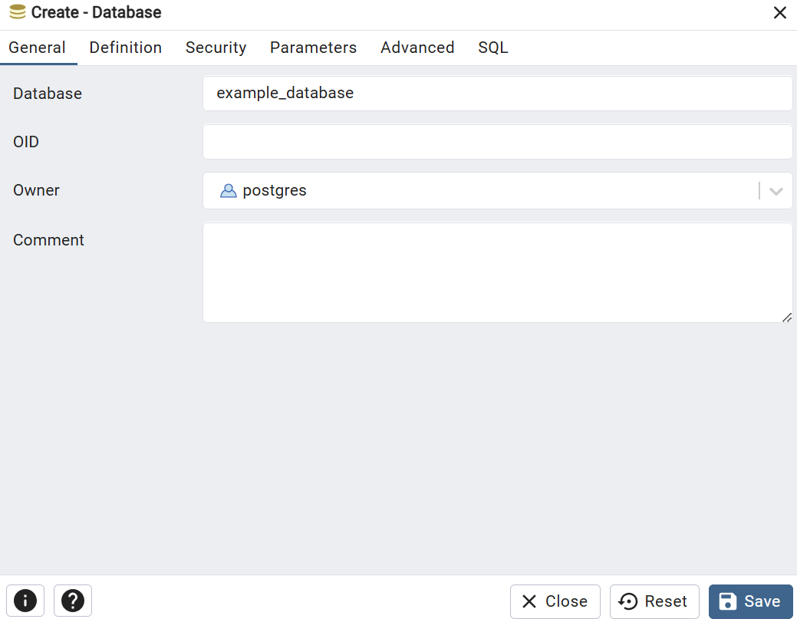

創建後就會在列表內看到你的 `Database` 了！
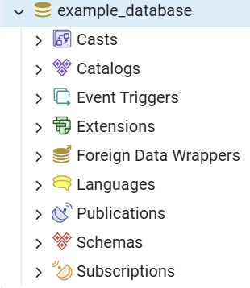

# 使用 SQL 語法操作資料庫

在這裡開始我們將使用簡單的 SQL 語法去對資料庫進行操作，在介面上執行 SQL 語法的方式是，先對你所創建的 `Database` 按右鍵，裡面會有個選項叫做 `Query Tool...`，點擊下去就會跳出可以輸入 SQL 語法執行的頁面。
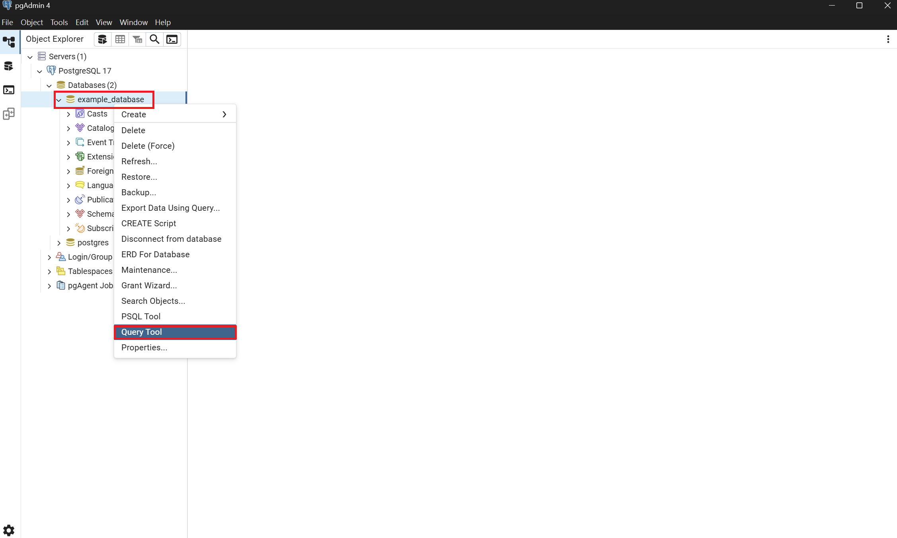

在 Query Tool 的頁面上，上方會是輸入 SQL 語法的區塊，下方會是結果，輸入完 SQL 語法要執行的話就按工具列上的播放鍵即可。
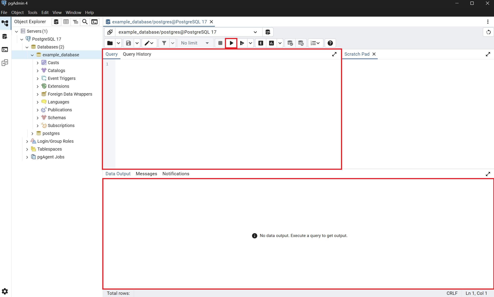

首先，我們要來將範例資料放進資料庫中，但在這之前我們先來知道一下sql可以存那些型態的資料跟如何建立`Table` 結構
以下是幾乎所有可能用到的sql資料結構:
```sql
-- 自定義 enum
CREATE TYPE MOOD_TYPE AS ENUM ('happy', 'sad', 'neutral');

-- 啟用一個 pgcrypto 的擴充功能 (Extension)
-- gen_random_uuid()需要這個Extension
CREATE EXTENSION IF NOT EXISTS "pgcrypto";


CREATE TABLE demo_all_types (
    -- 基本識別
    id SERIAL PRIMARY KEY,                         -- 整數自動遞增 (整數 + PK)

    -- 數值型別
    small_num SMALLINT,                            -- 小整數
    big_num BIGINT,                                -- 大整數
    precise_num NUMERIC(10,2),                     -- 高精度數值
    float_num DOUBLE PRECISION,                    -- 浮點數

    -- 布林值
    is_active BOOLEAN DEFAULT TRUE,                -- 布林

    -- 文字
    short_text VARCHAR(50),                        -- 有長度限制的字串
    long_text TEXT,                                -- 大字串

    -- 時間相關
    created_at TIMESTAMP DEFAULT now(),            -- 時間戳
    updated_date DATE,                             -- 日期
    duration INTERVAL,                             -- 時間區間

    -- 枚舉 (enum)
    mood MOOD_TYPE,                                -- 自定義 enum，例如 'happy', 'sad', 'neutral'

    -- JSON 與結構化
    profile JSON,                                  -- JSON
    profileb JSONB,                                -- JSONB (支援索引)

    -- 陣列
    tags TEXT[],                                   -- 文字陣列
    scores INTEGER[],                              -- 整數陣列

    -- 特殊型別
    uuid_col UUID DEFAULT gen_random_uuid(),       -- UUID
    ip_col INET,                                   -- IP 位址
    mac_col MACADDR,                               -- MAC 位址

    -- 幾何
    location POINT,                                -- 點 (x, y)
    area POLYGON                                   -- 多邊形
);
```

現在我們來定義範例的 `Table` 結構，底下是創建題目 `Table` 結構的語法：
```sql
CREATE TABLE Problems (
    ProblemId SERIAL PRIMARY KEY,
    Title text,
    Description text
);
```

`CREATE TABLE` 為 SQL 建立 `Table` 的語法，後頭接著的是 `Table` 的名稱，後面括弧裡面是這個 `Table` 裡面有哪些欄位，在這裡我們定義了三個欄位，一個是 `ProblemId`，一個是 `Title`，最後一個是 `Description`。

每個欄位名稱後頭接著自己的型態，`ProblemId` 後面接著的是 `SERIAL` 這個型態，這個型態是個特殊的型態，它代表的是序列編號，這個編號會由資料庫系統自己產生，它會自動累加上次給予的編號並將之填入給新增的資料，這可以解決「編號需要伺服器端自動產生」的問題。而接在後頭的 `PRIMARY KEY` 表示，如果有其他資料需要連結 `Problems` 的資料的話，可以利用這個 `ProblemId` 值去做連結。並且 `PRIMARY KEY` 同時也會讓資料庫系統在新增新資料的時候，保證不會有任何資料的該欄位會有重複的值，如果有這樣的情形發生的話，資料庫會回報錯誤回來。最後，後面兩個欄位 `Title` 和 `Description` 的型態皆是普通的 `text` 文字型態。

這裡你會發現我沒有在 `Problems` 裡面定義 `TestCases` 的資料，這是由於 `Problems` 對 `TestCases` 的關係為一對多的關係。你可以想像一下，如果 `Problems` 裡若有 `TestCases` 的欄位的話，則該欄位的值應該會是 `TestCasesId1, TestCasesId2, ......`，這個值在使用的時候還必須先透過將逗號分割的方式處理完後才能使用。在這種以表格做互相資料連結的資料庫（通常又稱為關聯式資料庫（Relational Database））裡面，有一個資料庫的設計技巧叫做資料庫正規化（Database normalization），在這種一對多的關係裡面，它會傾向於在多的那方增加欄位去說明它是屬於一的那方的哪筆資料，意思就是會在 `TestCases` 增加一個 `Foreign Key` 的欄位去參考（reference）到 `Problems` 的 `Primary Key` 欄位，讓兩者透過此參考產生關係。

我們在定義 `TestCases` 的表格定義就會如下：

```sql
CREATE TABLE TestCases (
    TestCasesId SERIAL PRIMARY KEY,
    TestInput text,
    ExpectedOutput text,
    Score integer,
    TimeoutSeconds double precision,
    ProblemId integer REFERENCES Problems (ProblemId)
);
```

上面程式碼中的 `integer` 和 `double precision` 分別代表整數型態以及雙倍精度浮點數的型態，而最後面的 `REFERENCES` 則是使這個欄位形成一個 `Foreign Key`，讓 `TestCases` 的 `ProblemId` 欄位資料會對應參考 `Problems` 表格中的 `ProblemId` 欄位資料。

做完上面兩個 SQL 了以後，應該就可以在左方的 Database 裡面看到上面所創建的兩個表格了。
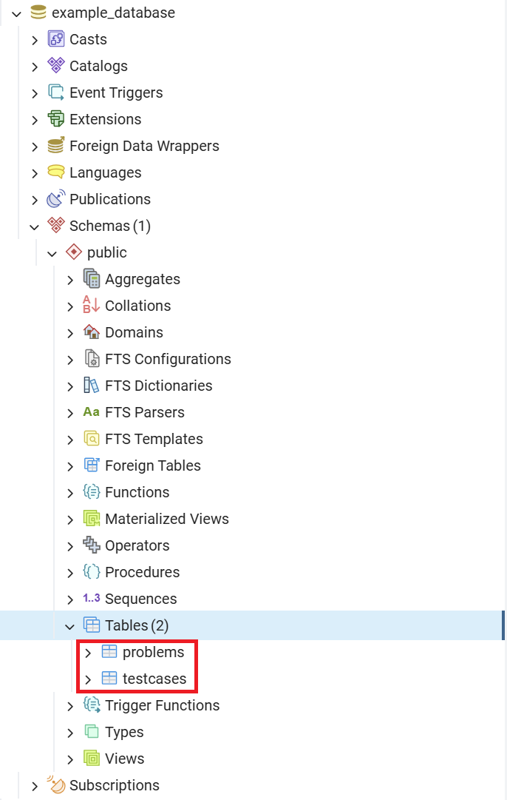

接下來就可以利用 `INSERT INTO` 和 `SELECT FROM` 的 SQL 語法來新增資料和讀取資料，底下增加一筆之前有看過的 `A + B Problem` 的資料進去當作示範。首先先新增一筆題目資料，使用 `INSERT INTO 表格名稱 (欄位1, 欄位2, ......) VALUES (欄位 1 的值, 欄位 2 的值, ......)` 來增加資料。
```sql
INSERT INTO Problems (Title, Description) 
VALUES ('A + B Problem', '輸入兩數，將兩數加總。');
```

接著使用 `SELECT 欄位列表 FROM 表格名稱`（欄位列表為 `*` 則為全部欄位）讀取看看 `Problems` 裡面的資料。
```sql
SELECT * FROM Problems;
```
可以看到資料表內的資料有我們剛新增的資料，並且其編號為 1。
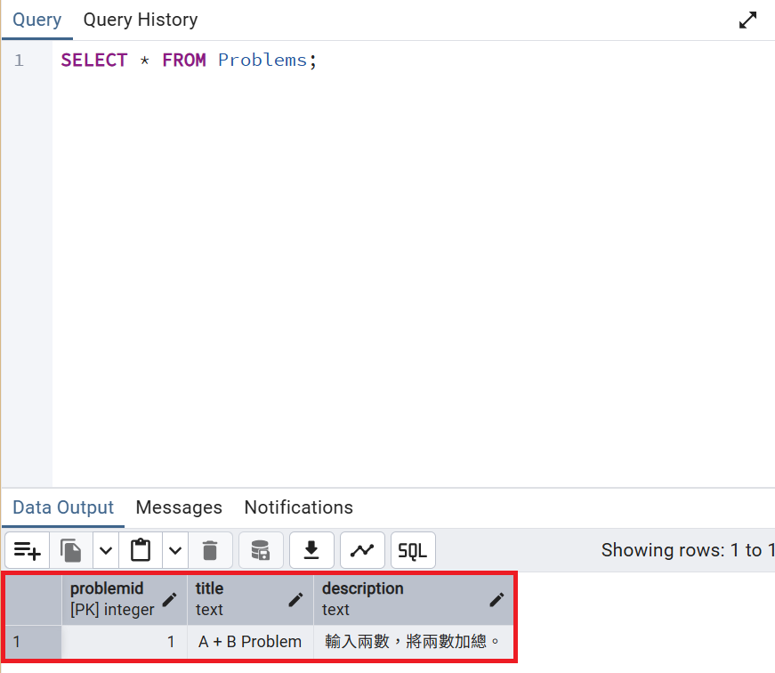

接著新增兩筆測資，將 Foreign Key 部分與編號 1 題目進行連結。

```sql
INSERT INTO TestCases (TestInput, ExpectedOutput, Score, TimeoutSeconds, ProblemId)
VALUES ('3 4', '7', 50, 10.0, 1);

INSERT INTO TestCases (TestInput, ExpectedOutput, Score, TimeoutSeconds, ProblemId)
VALUES ('2147483646 1', '2147483647', 50, 10.0, 1);
```

最後我們試著將 `Problems` 和 `TestCases` 利用 `Foreign Key` 將兩者關聯起來，可以使用 `INNER JOIN ON` 這個語法來進行，總體 SQL 語法如下：
```sql
SELECT * FROM Problems INNER JOIN TestCases ON (Problems.ProblemId = TestCases.ProblemId);
```
執行結果如下：
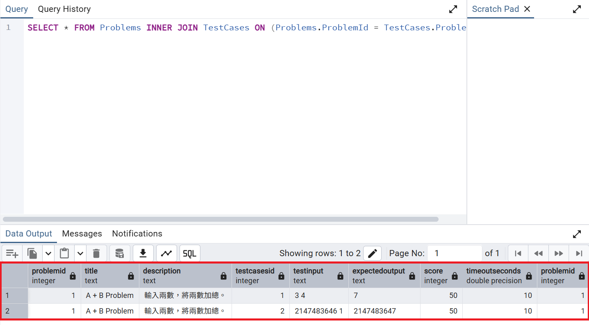

# 總結
最後總結一個PostgreSQL常用的語法
| 類別        | 語法範例 | 說明 |
|-------------|----------|------|
| **資料庫操作** | `CREATE DATABASE mydb;` | 建立資料庫 |
|             | `DROP DATABASE mydb;` | 刪除資料庫 |
|             | `\c mydb` | 切換至資料庫 (psql 指令) |
| **資料表操作** | `CREATE TABLE users (id SERIAL PRIMARY KEY, name TEXT);` | 建立資料表 |
|             | `DROP TABLE users;` | 刪除資料表 |
|             | `ALTER TABLE users ADD COLUMN age INT;` | 新增欄位 |
|             | `ALTER TABLE users DROP COLUMN age;` | 移除欄位 |
| **新增資料** | `INSERT INTO users (name, age) VALUES ('Alice', 20);` | 插入資料 |
| **修改資料** | `UPDATE users SET age = 21 WHERE id = 1;` | 更新資料 |
| **刪除資料** | `DELETE FROM users WHERE id = 1;` | 刪除資料 |
| **查詢資料** | `SELECT * FROM users;` | 查詢所有資料 |
|             | `SELECT name, age FROM users WHERE age > 18;` | 條件查詢 |
|             | `SELECT COUNT(*) FROM users;` | 聚合函數 (計數) |
|             | `SELECT AVG(age) FROM users;` | 聚合函數 (平均) |
| **排序/限制** | `SELECT * FROM users ORDER BY age DESC;` | 排序 |
|             | `SELECT * FROM users LIMIT 5 OFFSET 10;` | 分頁查詢 |
| **關聯 (JOIN)** | `SELECT * FROM orders INNER JOIN users ON orders.user_id = users.id;` | 內聯結 |
|             | `SELECT * FROM users LEFT JOIN orders ON users.id = orders.user_id;` | 左聯結 |
| **索引**     | `CREATE INDEX idx_users_name ON users(name);` | 建立索引 |
| **Transaction** | `BEGIN; ... COMMIT;` | 開啟交易並提交 |
|             | `ROLLBACK;` | 回滾交易 |
| **JSON**    | `SELECT profile->>'name' FROM demo_all_types;` | 取 JSON 欄位值 |
| **陣列**    | `SELECT * FROM demo_all_types WHERE 'tag1' = ANY(tags);` | 查詢陣列包含元素 |
| **UUID**    | `SELECT gen_random_uuid();` | 產生隨機 UUID（需 pgcrypto） |

