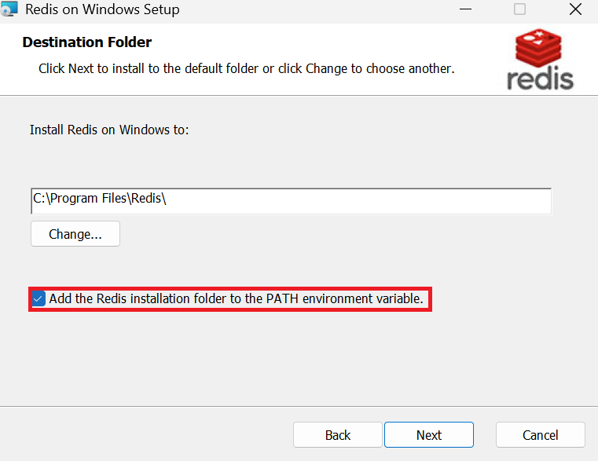
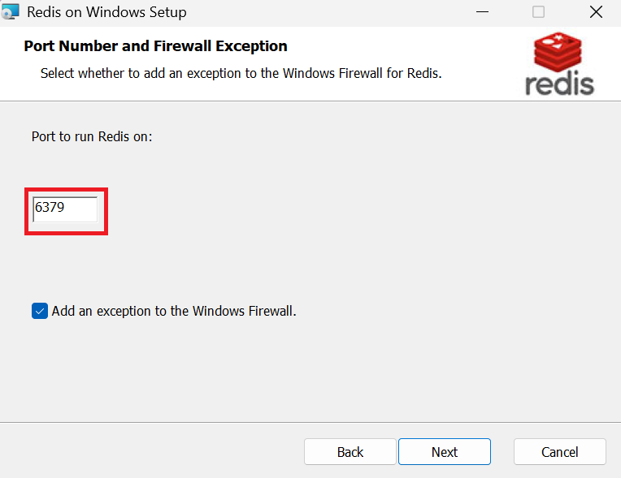
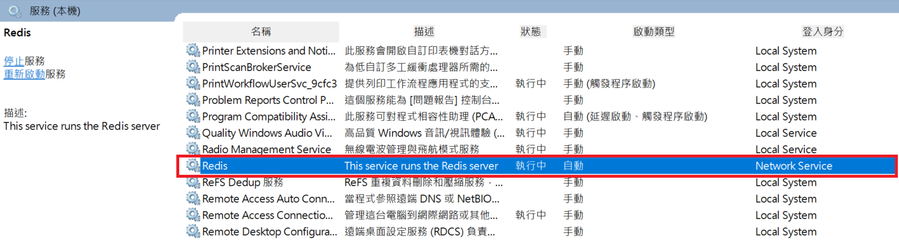
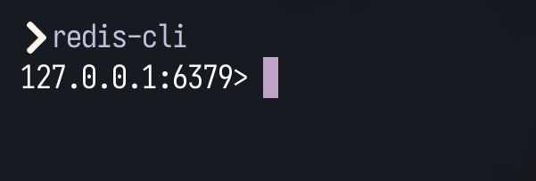
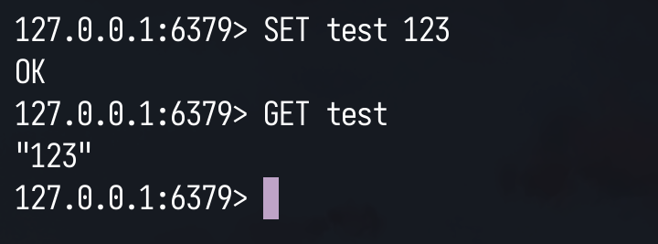

# Redis 使用教學入門
`Redis` 是 `Remote Dictionary Server` 的簡寫，意思為遠端字典Server。
字典Dictionary 即是`Key-Value`對照表。

Redis存放資料的速度極快，是物理層面上的快，因為**Redis對記憶體(Memory)進行操作。**

用以下數量級打個比方，
假如`磁碟(Disk、Storage)` 的讀寫速度是1、容量10000。
那麼...
`記憶體(Mem、RAM)` 的讀寫速度會是100、容量是100，
`CPU快取(Cache)`的讀寫速度是10000、容量是1。

Redis將資料存放於記憶體中的特點為：讀寫速度比存放於磁碟快、但容量較小，且資料在斷電就揮發(Volatile)不見了（若沒及時寫進磁碟中的話）
若有**短時間內大量存取**的需求，卻又不想如此頻繁的對硬碟讀寫，這種場合可以使用`Redis資料庫`暫時存放資料，等一段時間後再一齊寫入硬碟裡。

# 安裝Redis
Redis與`PostgreSQL`同樣是資料庫，分成Server端與Client端，只是存放資料的形式不同。
這篇只教windows跟linux還有docker的安裝方式

## Windows 安裝Redis
到[Github](https://github.com/tporadowski/redis/releases/tag/v5.0.14.1)下載 .msi安裝檔案，
接著下一步、勾選加入PATH環境變數


redis會預設開在6379端口，你也可以改成其他端口


預設會將Redis Server開啟成一項 `Windows服務`


Server端有了，再來啟動一個 `powershell` 來執行 Client端
```powershell
$ redis-cli
```

## linux安裝redis
一般在你的`linux發行版`所使用的套件管理器直接安裝就好了
安裝好後再用`systemctl enable`就可以了

- Ubuntu / Debian
```bash
sudo apt update
sudo apt install -y redis-server
sudo systemctl enable --now redis-server
```

- Arch Linux / Manjaro
```bash
sudo pacman -Syu --noconfirm redis
sudo systemctl enable --now redis
```

- Fedora / CentOS / RHEL
```bash
sudo dnf install -y redis
sudo systemctl enable --now redis
```
安裝完用 systemctl status redis* 檢查服務是否「active (running)」

## Docker 安裝Redis
把container命名為redis_test
```bash
$ docker run --name redis_test -d -p 6379:6379 redis
```
執行Client端
```bash
$ docker exec -it redis_test /bin/bash
# redis-cli
```
（要結束Redis的話）
```bash
$ docker container rm -f redis_test
```

# 使用Redis
Redis Server端預設使用 6379 port。
成功啟動Redis Server後的畫面。


此時對Client端下指令：
```bash
PING
```
會輸出`PONG` (測試用)
由於redis是`Key-Value`型的database
所以設定資料的方式如下
```bash
> SET test 123 # 設定一個鍵為:test 值為:123
> GET test     # 取得test的data
```


# Redis 基本指令：查詢
## 【Keys 查詢指令】
如果忘記自己下過哪些變數名稱了？
可利用KEYS指令，透過 `pattern(正規表達式)` 來查詢。
```bash
> KEYS *
```
Keys指令的時間複雜度為`O(n)`，會佔用Redis單線程、卡到後面讀寫指令，
在**程式開發、測試時**可以使用，但在大型正式運行的伺服器中千萬別使用`KEYS`相關指令，
查詢時若大批的資料湧進會造成堵塞、炸裂。建議改用`SCAN`指令來查詢。

## 【Scan 查詢指令】
在當前的Redis資料庫中進行迭代。
一開始先下`SCAN 0`，之後看他回傳的數值 接著繼續SCAN迭代下去。
```bash
> SCAN 0
```
此時若第一個回傳值為"15"
```bash
> SCAN 15
```
持續步驟直到第一個回傳值為"0"

## 【Type 查詢類型】
忘記這個Key對應到的是甚麼物件類型了？
查詢test的類型
```bash
> TYPE test
```
Redis鍵值資料庫中也有分格式，常用到的格式有：
1. 【字串 String】：可存放數字、字串。
2. 【哈希 Hash、Hashmap】：可存放 Hashmap 或稱Dictionary（Key-Value對照表）。
3. 【列表 List】：有順序的列表，可從列表左端或右端操作、新增刪除。
4. 【集合 Set】：存放唯一且不重複的項目。
5. 【有序集和 Sorted-Set】：存放唯一不重複項目，透過`Score`分數來排序，是個極度有趣的格式。

所有的指令在 Redis官網 都有詳細記載。
以下會快速導覽、稍微熟悉一下Redis指令用法。

# Redis 基本指令：新增、取得、刪除
## 【String 數值、字串】
雖然是字串，但實際上可以放數字。
### 【SET 設置】
設置 test1的值為123
```bash
> SET test1 123
```

設置 test1的值為字串
```bash
> SET test1 "Hello Redis"
```

設定此筆資料10秒後自動過期(Expired)、刪除。
```bash
> SET test1 "123" EX 10
```

### 【INCR、DECR 遞增減】
test1加1、test1減1
```bash
> INCR test1
> DECR test1
```

### 【INCRBY、DECRBY 加減法】
test1加50、test1減50
```bash
> INCRBY test1 50
> DECRBY test1 50
```

### 【StrLen 字串長度】
返回test1字串的長度
```bash
> STRLEN test1
```

### 【Append】
透過append在字尾新增字串hello，接著返回字串總長度
```bash
> APPEND test "hello"
```

### 【GET 取得】
```bash
> GET test1
```

### 【List 列表】
將a塞入list1之中
```bash
> LPUSH list1 hello
```
`LPUSH`: 往左側（頭）塞入元素a，若無list1則自動建立一個新的
`RPUSH`: 往右側（尾）塞入元素a，若無list1則自動建立一個新的
`LPUSHX`:若無list1則塞入失敗，不會自動建立

一次塞多個值進list1
```bash
> LPUSH list1 b c d a a a
```

將list1最左側（頭）的元素POP彈出
```bash
> LPOP list1
```

看 list1 之中 第0到100的元素（含0含100)
```bash
> LRANGE list1 0 100
```

若要查看所有元素可使用：`LRANGE list1 0 -1`。 Index -1 代表最後一個項目

## 【Hash、HashMap 哈希表】
`Hash`即為 一組Key對應到一組Value
HSET 設 hash1表裡面的 `h1`鍵 值為123
```bash
> HSET hash1 h1 123
```

HMSET 設置`hashmap`（一次設多個HSET）
```bash
> HMSET hash1 h2 234 h3 345 h4 456
```

取得hash1表中的 `h1` 的值
```bash
> HGET hash1 h1
```

取得hash1表中全部的鍵值
```bash
> HGETALL hash1
```
在Redis中 **不支援巢狀Hash**（hash中不能再設hash），
可以用`Serialize` 或 將兩個`Hash Table`當成 `key:value` 對應來達成
或者使用`ReJSON(Redis JSON)`，可方便儲存`Json`格式

### 【Set 集合】
`Set 集合`裡面的內容，是唯一且不重複的。
譬如學生的 **學號**
```bash
> SADD set1 "S00001"
> SADD set1 "S00002" "S00003" "S00004" "S00005" ...

> SCARD set1
	返回集合總數量

> SDIFF set1
	返回、列出不同的Set
```

### 【Sorted-Set 有序集合】
有`Score 分數`的集合。
可以想像成：考完期中考的學生，各自都會對應到一個分數。
**分數可重複，學生不能重複**

S00001 拿到了99分
S00002 拿到了3分
S00003 也拿到了3分
```bash
> ZADD exam 99 "S00001"
> ZADD exam 3 "S00002"
> ZADD exam 3 "S00003"
```

若加上XX的話，只會更新已存在的值，若無鍵 則不會新增。
```bash
> ZADD exam XX 100 "Teacher"
```

改成`NX`則相反：只新增鍵、不會更新已存在的
查看來考試的學生數量
```bash
> ZCARD exam
```

查看`S00001`的分數
```bash
> ZSCORE exam S00001
```

有幾個人分數落在0~10分的
```bash
> ZCOUNT exam 0 20
```

印出所有人的 排名（從低分印到高分）
```bash
> ZRANGE exam 0 -1
```

印所有人的 排名與分數（從低分印到高分）
```bash
> ZRANGE exam 0 -1 WITHSCORES
```

把 `S00001`的分數+3分
```bash
> ZINCRBY exam 3 S00001
```

# 總結一些常用指令的表格
## 連線、資料庫、一般操作
| 指令                     | 作用              | 常用參數/選項                              | 範例                    |
| ---------------------- | --------------- | ------------------------------------ | --------------------- |
| `PING`                 | 健康檢查            |                                      | `PING` → `PONG`       |
| `AUTH`                 | 驗證密碼/ACL 使用者    | `AUTH <pass>` 或 `AUTH <user> <pass>` | `AUTH default s3cr3t` |
| `HELLO`                | 切換協定/回傳伺服器資訊    | `HELLO 3`                            | `HELLO 3`             |
| `ECHO`                 | 回顯字串            |                                      | `ECHO "hi"`           |
| `SELECT`               | 切換 DB           | `0..15`（預設 16 個）                     | `SELECT 1`            |
| `FLUSHDB` / `FLUSHALL` | 清空單一 DB / 全部 DB | `ASYNC`                              | `FLUSHDB ASYNC`       |
| `DBSIZE`               | 目前 DB key 數     |                                      | `DBSIZE`              |
| `QUIT`                 | 關閉連線            |                                      | `QUIT`                |

## Key 與到期（TTL）
| 指令                       | 作用                   | 常用參數/選項                 | 範例                                 |
| ------------------------ | -------------------- | ----------------------- | ---------------------------------- |
| `EXISTS key [key ...]`   | key 是否存在             |                         | `EXISTS a b`                       |
| `DEL` / `UNLINK`         | 刪 key（`UNLINK` 非阻塞）  |                         | `UNLINK big:set`                   |
| `TYPE`                   | key 類型               |                         | `TYPE user:1`                      |
| `EXPIRE` / `PEXPIRE`     | 設 TTL（秒/毫秒）          | `EXPIRE key sec`        | `EXPIRE a 60`                      |
| `EXPIREAT` / `PEXPIREAT` | 設到期絕對時間              | Unix(sec/ms)            | `EXPIREAT a 1755730000`            |
| `TTL` / `PTTL`           | 剩餘 TTL               |                         | `TTL a`                            |
| `PERSIST`                | 取消 TTL               |                         | `PERSIST a`                        |
| `RENAME` / `RENAMENX`    | 改名（避免覆蓋用 `RENAMENX`） |                         | `RENAMENX a a:old`                 |
| `SCAN`                   | 遍歷鍵（非阻塞）             | `MATCH <pat>`、`COUNT n` | `SCAN 0 MATCH "user:*" COUNT 100`  |
| `COPY`                   | 複製 key               | `DB n`、`REPLACE`        | `COPY a b REPLACE`                 |
| `DUMP` / `RESTORE`       | 序列化 / 還原             | `REPLACE`、`TTL ms`      | `DUMP a` → `RESTORE a2 0 "<blob>"` |

## String（字串/數值）
| 指令                      | 作用        | 常用參數/選項                                     | 範例                                    |
| ----------------------- | --------- | ------------------------------------------- | ------------------------------------- |
| `SET`                   | 設值        | `EX/PX`、`EXAT/PXAT`、`NX/XX`、`KEEPTTL`、`GET` | `SET k v EX 10 NX`；`SET k v GET`      |
| `GET`                   | 取值        |                                             | `GET k`                               |
| `GETSET` / `GETDEL`     | 取舊值並設新/刪除 |                                             | `GETSET k v2`；`GETDEL k`              |
| `MSET` / `MGET`         | 多鍵設/取     |                                             | `MSET a 1 b 2`；`MGET a b`             |
| `INCR` / `DECR`         | 整數 +1/-1  |                                             | `INCR counter`                        |
| `INCRBY` / `DECRBY`     | 整數加減      |                                             | `INCRBY score 50`                     |
| `INCRBYFLOAT`           | 浮點加法      |                                             | `INCRBYFLOAT price 0.5`               |
| `APPEND`                | 追加字尾      |                                             | `APPEND note " world"`                |
| `STRLEN`                | 長度        |                                             | `STRLEN note`                         |
| `SETRANGE` / `GETRANGE` | 局部覆寫/讀片段  |                                             | `SETRANGE k 5 "abc"`；`GETRANGE k 0 4` |
| `GETEX`                 | 取值同時改 TTL | `EX/PX`/`PERSIST`                           | `GETEX k EX 60`                       |

## List（列表）
| 指令                  | 作用           | 常用參數/選項                    | 範例                              |
| ------------------- | ------------ | -------------------------- | ------------------------------- |
| `LPUSH` / `RPUSH`   | 左/右推入        | 可多值                        | `LPUSH list a b c`              |
| `LPUSHX` / `RPUSHX` | 只有存在才推       |                            | `LPUSHX list x`                 |
| `LPOP` / `RPOP`     | 左/右彈出        | `COUNT n`（新）               | `LPOP list`；`RPOP list COUNT 2` |
| `BLPOP` / `BRPOP`   | 阻塞彈出         | `timeout`                  | `BLPOP q 5`                     |
| `LLEN`              | 長度           |                            | `LLEN list`                     |
| `LINDEX`            | 取索引          |                            | `LINDEX list 0`                 |
| `LSET`              | 設索引值         |                            | `LSET list 1 x`                 |
| `LRANGE`            | 範圍取出         | `0 -1` 取全                  | `LRANGE list 0 -1`              |
| `LREM`              | 刪除匹配項        | `count`                    | `LREM list 0 "a"`（全刪）           |
| `LMOVE`             | 左/右移到另一 List | `LMOVE src dst LEFT RIGHT` | `LMOVE q work LEFT RIGHT`       |
| `LPOS`              | 找到第一個匹配索引    | `RANK`、`MAXLEN`            | `LPOS list "x"`                 |

## Hash（哈希表）
| 指令                         | 作用        | 常用參數/選項              | 範例                               |
| -------------------------- | --------- | -------------------- | -------------------------------- |
| `HSET`                     | 設欄位       | 可多對                  | `HSET user:1 name neko age 18`   |
| `HGET`                     | 取欄位       |                      | `HGET user:1 name`               |
| `HMGET`                    | 取多欄位      |                      | `HMGET user:1 name age`          |
| `HGETALL`                  | 取全部欄位     |                      | `HGETALL user:1`                 |
| `HDEL`                     | 刪欄位       | 可多欄位                 | `HDEL user:1 age`                |
| `HEXISTS`                  | 欄位是否存在    |                      | `HEXISTS user:1 name`            |
| `HINCRBY` / `HINCRBYFLOAT` | 欄位加法      |                      | `HINCRBY user:1 coins 5`         |
| `HKEYS` / `HVALS`          | 列鍵/值      |                      | `HKEYS user:1`                   |
| `HLEN`                     | 欄位數       |                      | `HLEN user:1`                    |
| `HRANDFIELD`               | 隨機欄位（可回值） | `WITHVALUES`、`COUNT` | `HRANDFIELD user:1 2 WITHVALUES` |

## Set（集合）
| 指令                         | 作用         | 常用參數/選項         | 範例                                   |
| -------------------------- | ---------- | --------------- | ------------------------------------ |
| `SADD` / `SREM`            | 加/刪成員      | 可多值             | `SADD s a b c`                       |
| `SMEMBERS`                 | 列全部成員      | （大集合請用 `SSCAN`） | `SMEMBERS s`                         |
| `SISMEMBER` / `SMISMEMBER` | 是否為成員 / 多查 |                 | `SISMEMBER s a`；`SMISMEMBER s a b`   |
| `SCARD`                    | 集合大小       |                 | `SCARD s`                            |
| `SPOP`                     | 隨機彈出       | `COUNT`         | `SPOP s 2`                           |
| `SRANDMEMBER`              | 隨機取        | `COUNT`         | `SRANDMEMBER s 3`                    |
| `SINTER`/`SUNION`/`SDIFF`  | 交並差        | `…STORE dest`   | `SINTER s1 s2`；`SINTERSTORE d s1 s2` |
| `SSCAN`                    | 遍歷集合       | `MATCH`、`COUNT` | `SSCAN s 0 MATCH "u:*"`              |

## Sorted Set（有序集合，ZSet）
| 指令                            | 作用                 | 常用參數/選項                                      | 範例                                                        |
| ----------------------------- | ------------------ | -------------------------------------------- | --------------------------------------------------------- |
| `ZADD`                        | 新增/更新分數            | `NX/XX`、`CH`、`INCR`                          | `ZADD exam 99 "S00001"`；`ZADD exam INCR 3 "S00001"`       |
| `ZREM`                        | 刪成員                | 可多值                                          | `ZREM exam S00002`                                        |
| `ZSCORE` / `ZMSCORE`          | 取分數 / 多取           |                                              | `ZSCORE exam S00001`                                      |
| `ZCARD` / `ZCOUNT`            | 數量 / 分數區間數         |                                              | `ZCOUNT exam 0 60`                                        |
| `ZRANK` / `ZREVRANK`          | 排名（低→高 / 反向）       |                                              | `ZRANK exam S00001`                                       |
| `ZRANGE` / `ZREVRANGE`        | 取名次區間              | `WITHSCORES`、`BYSCORE`、`BYLEX`、`REV`、`LIMIT` | `ZRANGE exam 0 -1 WITHSCORES`；`ZRANGE exam 0 100 BYSCORE` |
| `ZRANGEBYSCORE`               | 依分數區間              | `WITHSCORES`、`LIMIT`                         | `ZRANGEBYSCORE exam 80 +inf WITHSCORES`                   |
| `ZPOPMIN` / `ZPOPMAX`         | 彈出最小/最大            | `COUNT`                                      | `ZPOPMAX exam 3`                                          |
| `ZINTER` / `ZUNION` / `ZDIFF` | 交並差                | `…STORE dest`、`WEIGHTS`、`AGGREGATE`          | `ZUNIONSTORE board 2 a b WEIGHTS 1 0.5`                   |
| `ZRANGESTORE`                 | 把 range 結果存到新 ZSet |                                              | `ZRANGESTORE top exam 0 9`                                |

## Pub/Sub（訂閱發布）
| 指令                         | 作用             | 常用參數/選項             | 範例                                   |
| -------------------------- | -------------- | ------------------- | ------------------------------------ |
| `SUBSCRIBE` / `PSUBSCRIBE` | 訂閱頻道 / Pattern |                     | `SUBSCRIBE news`；`PSUBSCRIBE news.*` |
| `PUBLISH`                  | 發布訊息           |                     | `PUBLISH news "hello"`               |
| `PUBSUB`                   | 查詢統計           | `CHANNELS`、`NUMSUB` | `PUBSUB CHANNELS "news*"`            |

## Stream（事件流，類 Kafka 小型替代）
| 指令                     | 作用         | 常用參數/選項                       | 範例                                          |
| ---------------------- | ---------- | ----------------------------- | ------------------------------------------- |
| `XADD`                 | 加入事件       | `*` 自動 ID、`MAXLEN ~ n`        | `XADD mystream * user neko msg hi`          |
| `XRANGE` / `XREVRANGE` | 讀取區間       | `- +` 全部                      | `XRANGE mystream - +`                       |
| `XREAD`                | 從 ID 之後讀   | `BLOCK ms`                    | `XREAD BLOCK 0 STREAMS mystream $`          |
| `XGROUP CREATE`        | 建消費群組      | `MKSTREAM`                    | `XGROUP CREATE mystream g1 $ MKSTREAM`      |
| `XREADGROUP`           | 群組讀取       | `GROUP g1 c1`、`COUNT`、`BLOCK` | `XREADGROUP GROUP g1 c1 STREAMS mystream >` |
| `XACK`                 | 確認已處理      |                               | `XACK mystream g1 1690-0`                   |
| `XPENDING`             | 查看掛起       | `RANGE`、`COUNT`               | `XPENDING mystream g1`                      |
| `XDEL` / `XTRIM`       | 刪事件 / 修剪流長 | `MAXLEN/MINID`、`~`            | `XTRIM mystream MAXLEN ~ 10000`             |

## Bitmap / HyperLogLog / Geo
| 類型          | 指令                                                                 | 作用        | 範例                                                                                              |
| ----------- | ------------------------------------------------------------------ | --------- | ----------------------------------------------------------------------------------------------- |
| Bitmap      | `SETBIT`/`GETBIT`、`BITCOUNT`、`BITOP`、`BITFIELD`                    | 位圖標記與統計   | `SETBIT uv 123 1`；`BITCOUNT uv`                                                                 |
| HyperLogLog | `PFADD`、`PFCOUNT`、`PFMERGE`                                        | 近似去重計數    | `PFADD hll a b c`；`PFCOUNT hll`                                                                 |
| Geo         | `GEOADD`、`GEOPOS`、`GEODIST`、`GEOHASH`、`GEOSEARCH`/`GEOSEARCHSTORE` | 地理座標與範圍查詢 | `GEOADD geo:shop 121.5 25.0 "store:1"`；`GEOSEARCH geo:shop FROMLONLAT 121.5 25.0 BYRADIUS 5 km` |

## 交易 / 標記監控 / Lua
| 指令                   | 作用         | 常用參數/選項            | 範例                                              |
| -------------------- | ---------- | ------------------ | ----------------------------------------------- |
| `MULTI` → … → `EXEC` | 交易         |                    | `MULTI` → `INCR a` → `INCR b` → `EXEC`          |
| `DISCARD`            | 放棄交易       |                    | `DISCARD`                                       |
| `WATCH` / `UNWATCH`  | 標記 key，樂觀鎖 |                    | `WATCH order:1`；`MULTI … EXEC`                  |
| `EVAL` / `EVALSHA`   | 執行 Lua 腳本  | `numkeys ... args` | `EVAL "return redis.call('INCR', KEYS[1])" 1 k` |

## 監控、設定、持久化、複寫與叢集
| 指令                          | 作用       | 常用參數/選項                                  | 範例                        |
| --------------------------- | -------- | ---------------------------------------- | ------------------------- |
| `INFO`                      | 伺服器狀態    | `INFO memory` 等章節                        | `INFO memory`             |
| `MONITOR`                   | 即時監控指令流  |                                          | `MONITOR`                 |
| `SLOWLOG`                   | 慢查詢      | `GET`、`LEN`、`RESET`                      | `SLOWLOG GET 10`          |
| `CONFIG GET/SET`            | 讀改設定     |                                          | `CONFIG GET maxmemory`    |
| `CONFIG REWRITE`            | 將動態修改寫回檔 |                                          | `CONFIG REWRITE`          |
| `SAVE` / `BGSAVE`           | 立刻/背景快照  |                                          | `BGSAVE`                  |
| `BGREWRITEAOF`              | 重寫 AOF   |                                          | `BGREWRITEAOF`            |
| `MEMORY USAGE/STATS`        | 記憶體觀測    |                                          | `MEMORY USAGE key`        |
| `CLIENT LIST/PAUSE/ID/KILL` | 連線管理     |                                          | `CLIENT LIST`             |
| `ACL` 系列                    | 權限控制     | `SETUSER/DELUSER/WHOAMI` 等               | `ACL WHOAMI`              |
| `REPLICAOF`（舊 `SLAVEOF`）    | 設為從屬/主庫  | `REPLICAOF host port`、`REPLICAOF NO ONE` | `REPLICAOF 10.0.0.2 6379` |
| `ROLE`                      | 角色資訊     |                                          | `ROLE`                    |
| `CLUSTER`                   | 叢集管理     | `NODES/MEET/ADDSLOTS` 等                  | `CLUSTER NODES`           |

