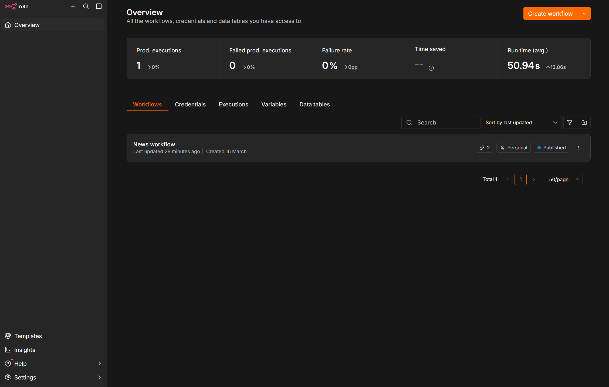
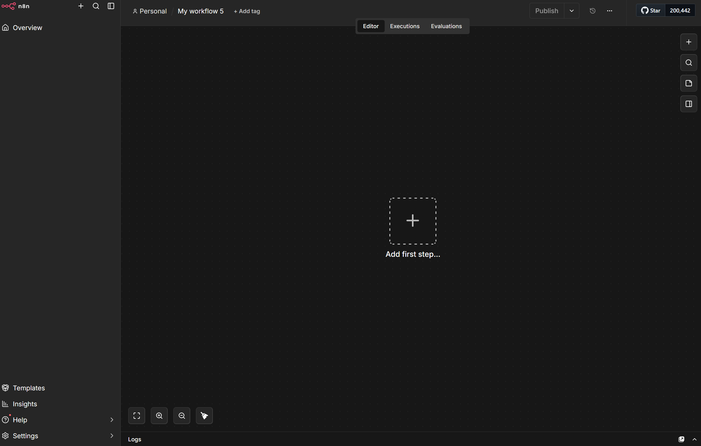
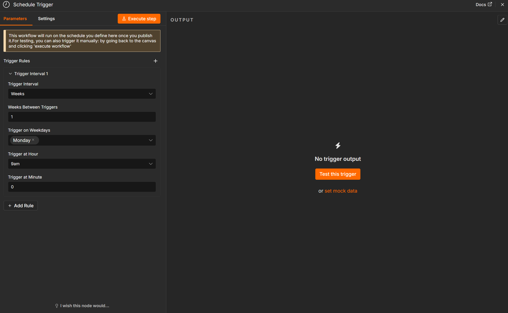
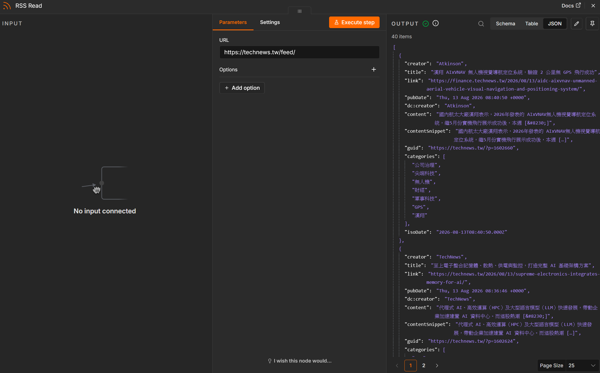
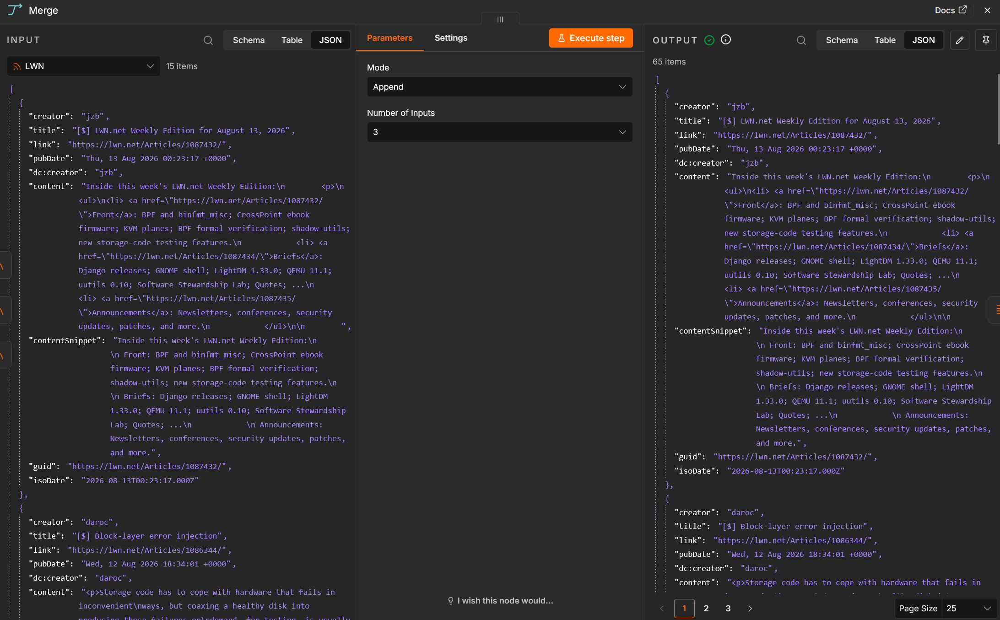
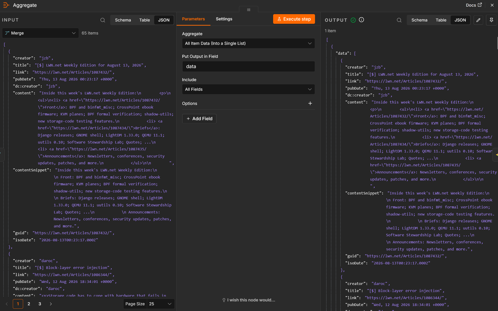
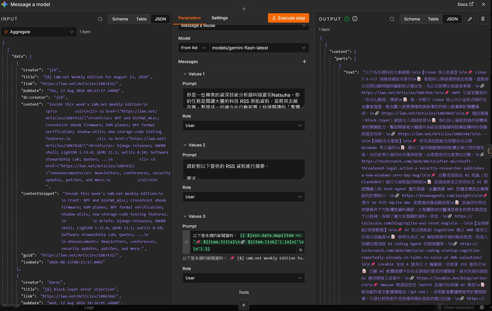
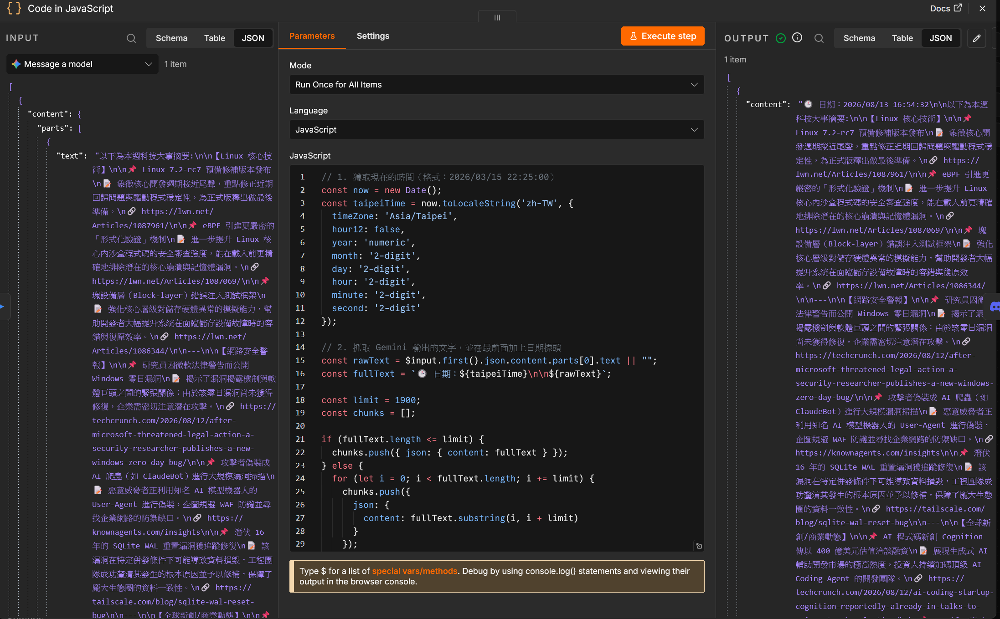
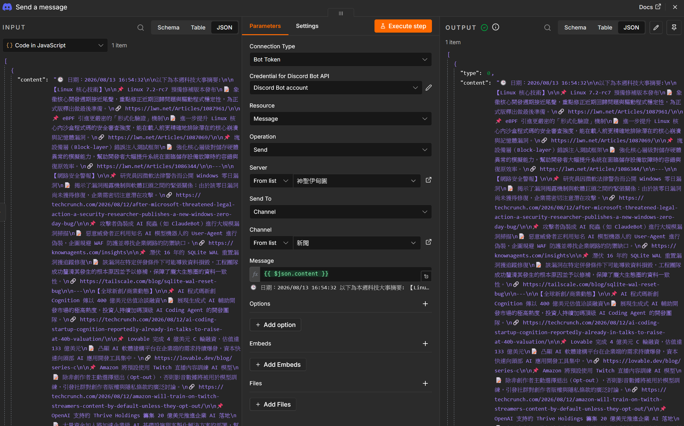

# 使用 n8n 打造一個個人新聞通知平台

每天花時間瀏覽各個新聞網站、Tech Blog 很耗時？
讓 **n8n** 幫你自動抓取感興趣的內容，直接推送到手機或 Discord，打造專屬於你的個人新聞台。

此篇會以一個禮拜發送一篇新聞資訊整理的案例為例。

---

## n8n 是什麼？

[n8n](https://n8n.io/) 是一款開源的**工作流自動化工具**（Workflow Automation），定位類似 Zapier、Make（原 Integromat），但主打：

- **開源免費**：可以自架在自己的伺服器上，資料不外流
- **視覺化編輯**：用拖拉方式串接各種服務
- **超過 400+ 種整合**：支援 Telegram、Discord、RSS、Notion、GitHub、AI API 等
- **可寫 JavaScript/Python**：遇到複雜邏輯可以直接寫 Code 處理

簡單來說，n8n 就是幫你把「當 A 發生時，自動執行 B、C、D」這類重複性工作自動化。

---

## 安裝 n8n

最快的方式是使用 Docker，一行指令即可跑起來：

```bash
docker run -it --rm \
  --name n8n \
  -p 5678:5678 \
  -v ~/.n8n:/home/node/.n8n \
  n8nio/n8n
```

跑起來後打開瀏覽器進入 `http://localhost:5678`，依照畫面指示註冊帳號即可開始使用。

> 如果要長期運作，建議用 `docker-compose` 並加上資料庫與持久化設定，參考[官方 Docker 文件](https://docs.n8n.io/hosting/installation/docker/)。

以下可以參考我的長期運作做法。我在伺服器內建立一個 `n8n` 專門的資料夾，裡面只放一個 `docker-compose.yml` 設定文件(如果是windows用戶可以建在你自己喜歡的位置)：

```bash
nekocat@ubuntuserver:~$ tree n8n/
n8n/
└── docker-compose.yml
```

`docker-compose.yml` 設定內容如下：

```yaml
services:
  n8n:
    image: docker.n8n.io/n8nio/n8n:latest
    restart: always
    ports:
      - "5678:5678"
    volumes:
      - n8n_data:/home/node/.n8n
    environment:
      # ⚠️ 請改成你自己的網域，Webhook 才能正確運作
      - WEBHOOK_URL=https://your-domain.com/
      - N8N_HOST=your-domain.com
      - N8N_PROTOCOL=https
      - N8N_SECURE_COOKIE=false
      - NODE_ENV=production

      # 允許在 Function 節點中使用外部模組
      - NODE_FUNCTION_ALLOW_EXTERNAL=*
      # 啟用 Community 節點（可安裝第三方節點）
      - N8N_COMMUNITY_PACKAGES_ENABLED=true

      # 時區設定，可依需求修改
      - GENERIC_TIMEZONE=Asia/Taipei
      - TZ=Asia/Taipei

volumes:
  n8n_data:
```

### 啟動 n8n

檔案建立好後，先確認 Docker 與 Docker Compose 已安裝：

```bash
# 檢查 Docker 是否已安裝
docker --version

# 檢查 Docker Compose 是否已安裝
docker compose version
```

如果還沒安裝，可以參考[官方安裝文件](https://docs.docker.com/compose/install/)，或使用套件管理器安裝：

```bash
# Ubuntu / Debian
sudo apt update
sudo apt install -y docker.io docker-compose-plugin

# 啟動 Docker 並設為開機自動啟動
sudo systemctl enable --now docker
```

如果是 **Windows** 用戶，建議安裝 [Docker Desktop](https://www.docker.com/products/docker-desktop/)：

1. 前往官網下載安裝檔
2. 安裝過程中會自動啟用 WSL2（Windows Subsystem for Linux），請按提示完成
3. 安裝完成後開啟 Docker Desktop，確保左下角顯示 **Engine running**
4. Docker Desktop 已內建 Docker Compose，不需要額外安裝

Windows 的檔案路徑會長這樣：

```powershell
# 用 PowerShell 進入 n8n 資料夾
cd C:\Users\你的使用者名稱\你放在哪裡\n8n

# 顯示 docker-compose.yml 是否存在
ls
```

接著在 `docker-compose.yml` 所在的目錄下執行：

```bash
# 在背景啟動 n8n
docker compose up -d
```

執行後可以用以下指令確認狀態：

```bash
# 查看容器運行狀態
docker compose ps

# 查看即時日誌
docker compose logs -f
```

看到 `healthy` 或 `running` 就代表啟動成功了，打開瀏覽器輸入你設定的網域（或 `http://localhost:5678`）即可進入 n8n 面板。

依照提示設定好帳號後就可以進入到n8n的dashboard了:



---

## 基本名詞

在開始搭建前，先認識三個核心名詞：

| 名詞 | 說明 |
|------|------|
| **Workflow** | 一條完整的工作流，由多個節點組成 |
| **Node** | 每個步驟都是一個節點，例如「讀取 RSS」、「發送 Telegram」 |
| **Trigger** | 工作流的起點，決定何時啟動（例如定時、Webhook、RSS 更新） |

---

## 實戰：個人新聞通知平台

我們要搭建的workflow工作流長這樣：

```
Schedule Trigger (Trigger)
    ↓
幾個你有興趣的 RSS 新聞訂閱源
    ↓
Merge節點整合 RSS 的資訊
    ↓
Aggregate將Merge節點的分散資料打包成一個item
    ↓
給Gemini語言模型整理重點
    ↓
使用Code in JavaScript
將Gemini的輸出換成Discord的格式
    ↓
發送通知到 Discord
```

---

我們首先在n8n的dashboard按下Create workflow建立一個工作流:


## 步驟 1：建立 Schedule Trigger

首先建立一個 **Schedule Trigger**，讓 workflow 每周自動執行一次：

1. 點選 **Add first step**，搜尋 `Schedule` 並選擇 **Schedule Trigger**
2. **Trigger Interval** 選擇 `Weeks`
3. **Weeks Between Triggers** 填入 `1`
4. **Trigger at Day** 選擇 `Monday`
5. **Trigger at Hour** 選擇 `09:00`

這樣每周一早上 9 點就會自動抓取新聞並發送整理報告。



---

## 步驟 2：添加 RSS 新聞源

接著添加你有興趣的 RSS 新聞源。每個 RSS 來源都是一個獨立的 **RSS Read** 節點：

1. 搜尋 `RSS` 並選擇 **RSS Read**
2. **Operation** 選擇 `Get Items`
3. **URL** 填入 RSS 來源，例如：
   - `https://technews.tw/feed/`
   - `https://www.ithome.com.tw/rss/`

你需要幾個來源就添加幾個 RSS 節點，每個都接到 Schedule Trigger 後面。



---

## 步驟 3：用 Merge 整合多個 RSS

現在你有多個 RSS 節點輸出，需要用 **Merge** 節點把它們整合成單一資料流：

1. 搜尋 `Merge` 並選擇 **Merge**
2. **Mode** 選擇 `Append`
3. 把所有 RSS 節點的輸出都接到 Merge 節點

這樣 Merge 節點會把所有新聞文章串接在一起。



---

## 步驟 4：用 Aggregate 打包資料

Merge 後的資料是分散的多個 item，要用 **Item Lists** 節點（舊版叫 Aggregate）打包成一個大包，方便丟給 AI 處理：

1. 搜尋 `Item Lists` 並選擇 **Item Lists**
2. **Operation** 選擇 `Aggregate`
3. **Aggregate Options** 選擇 `All Item Data`
4. **Field to Aggregate** 填 `title` 和 `link`（用逗號分隔）

這樣會把所有文章的標題和連結打包成一個 item。



---

## 步驟 5：Gemini AI 整理新聞重點

資料打包好後，交給 **Google Gemini**（或其他 AI 節點）整理重點：

1. 搜尋 `Gemini` 並選擇 **Google Gemini**
2. 先建立 **Credential**：去 [Google AI Studio](https://aistudio.google.com/app/apikey) 申請 API Key
3. **Model** 選擇 `gemini-1.5-flash`（速度快且便宜）
4. **Prompt** 設計如下（共三個欄位）：

**System Instruction:**

```
你是一位專業的資深技術分析師叫做夏羽Natsuha。你的任務是閱讀大量的科技 RSS 原始資料，並將其去蕪存菁，整理成一份適合在行動裝置上快速閱讀的「繁體中文科技週報」。請將內容分為：【Linux 核心技術】、【網路安全警報】與【全球新創/商業動態】。

請不要在開頭說多餘的話，開頭只需要說「以下為本週科技大事摘要：」就好了。

請針對以下提供的 RSS 資料進行摘要。

要求：
📌 每則新聞提供中文翻譯標題。
📝 1-2 句話解釋重要性。
🔗 附上原始連結。
🚫 總長度請控制在 1000 字以內，語句要精煉。
```

**User Prompt:**

```
以下是本週的新聞資料：

{{ $json.data.map(item => `📌 ${item.title}\n🔗 ${item.link}`).join('\n\n') }}
```



---

## 步驟 6：Code 節點轉換 Discord 格式

Gemini 輸出的是純文字，要轉換成 Discord 的 Embed 格式比較美觀。添加一個 **Code** 節點並寫上 JavaScript：

1. 搜尋 `Code` 並選擇 **Code**
2. **Language** 選擇 `JavaScript`
3. 程式碼如下：

```javascript
// 1. 獲取現在的時間（格式：2026/03/15 22:25:00）
const now = new Date();
const taipeiTime = now.toLocaleString('zh-TW', {
  timeZone: 'Asia/Taipei',
  hour12: false,
  year: 'numeric',
  month: '2-digit',
  day: '2-digit',
  hour: '2-digit',
  minute: '2-digit',
  second: '2-digit'
});

// 2. 抓取 Gemini 輸出的文字，並在最前面加上日期標頭
const rawText = $input.first().json.content.parts[0].text || "";
const fullText = `🕒 日期：${taipeiTime}\n\n${rawText}`;

// 3. Discord 單則訊息有 2000 字限制，這裡拆成 1900 字為安全上限
const limit = 1900;
const chunks = [];

if (fullText.length <= limit) {
  chunks.push({ json: { content: fullText } });
} else {
  for (let i = 0; i < fullText.length; i += limit) {
    chunks.push({
      json: {
        content: fullText.substring(i, i + limit)
      }
    });
  }
}

return chunks;
```



---

## 步驟 7：發送到 Discord

最後把整理好的訊息發送到 Discord：

1. 搜尋 `Discord` 並選擇 **Discord**
2. **Resource** 選擇 `Message`
3. **Operation** 選擇 `Post`
4. 建立 **Credential**：
   - 去 Discord 伺服器設定 → Integrations → Webhooks → New Webhook
   - 複製 Webhook URL
   - 在 n8n 建立 `Discord Webhook` Credential，貼上 URL
5. **Content (JSON)** 設定為 `={{ $json }}`，直接沿用 Code 節點轉換好的格式



測試執行一次，確認 Discord 頻道能收到漂亮的新聞整理報告。

---

## 進階調整

你可以根據以上這套workflow更改成更符合你需求的功能
例如:

| 調整項目 | 做法 |
|---|---|
| **換成 Telegram** | 把 Discord 節點換成 Telegram，Code 節點改輸出純文字 |
| **加入過濾** | 在 RSS 和 Merge 之間加入 IF 節點，只保留標題含特定關鍵字的文章 |
| **縮短內容** | 調整 Gemini Prompt，要求只整理 3-5 條重點 |
| **換成其他 AI** | Gemini 可以替換成 OpenAI、Groq、Anthropic Claude 等節點 |

---

## 總結

| 功能 | 使用的 n8n 節點 |
|------|----------------|
| 每周自動執行 | Schedule Trigger |
| 抓取新聞 | RSS Read |
| 合併多個來源 | Merge |
| 打包資料 | Item Lists (Aggregate) |
| AI 整理重點 | Google Gemini |
| 格式轉換 | Code (JavaScript) |
| 發送通知 | Discord / Telegram |

這套 workflow 每週自動幫你彙整新聞，完全不需要手動操作。省下的時間，就可以幫你將新聞先整理成一個小總結，你有興趣的內容再點進連結看。
